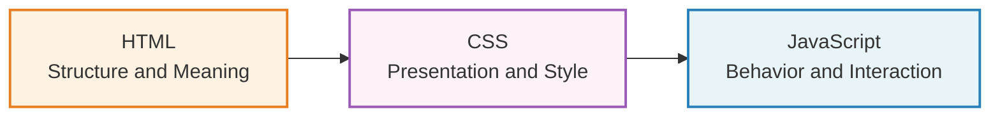

HTML (HyperText Markup Language) is the language that gives a web page its **structure and meaning**. It doesn't control how things look (that's CSS's job) and it doesn't control how things behave (that's JavaScript's job). HTML simply says: "this is a heading," "this is a paragraph," "this is an image of a painting."

Think of it as three layers, each with a distinct job:

HTML is the sketch, the wireframe, the composition before any rendering. CSS is the color, the type, the spacing, the visual treatment. JavaScript is the interaction, the dynamic response.

If you stripped away all the CSS from any website, you'd be left with a plain document of text, images, and links. That document should still make sense on its own. It should still have a clear hierarchy, a logical reading order, and meaningful structure. That is what good HTML gives you.

Want to know what "good structure without any styling" actually looks like? Here's the portfolio page from [Chapter 8](/html/attributes/), rendered with [construct.css](https://t7.github.io/construct.css/), a tool that draws visible boxes around every semantic HTML element. Every `<header>`, `<main>`, `<section>`, `<article>`, and `<footer>` gets a labeled outline, making invisible structure visible. We'll come back to this at the end of the guide.





## Why "semantic" HTML matters

The word **semantic** means "relating to meaning." When we talk about semantic HTML, we mean choosing elements based on what the content *is*, not what we want it to *look like*.

For example, you might want some text to appear big and bold. You could wrap it in a generic element and style it with CSS. But if that text is actually a heading, you should use a heading element. Why?

- **Accessibility**: Screen readers and assistive technologies rely on HTML to understand the page. A heading element tells a screen reader "this is a heading." A styled `
` tells it nothing.
- **Search engines**: Search engines read the HTML structure to understand what a page is about.
- **Your future self**: Meaningful markup is easier to read, maintain, and style.

The good news is that choosing the right element is usually intuitive. You already know the difference between a heading and a paragraph, between a navigation menu and a footer. HTML just asks you to make that explicit.
