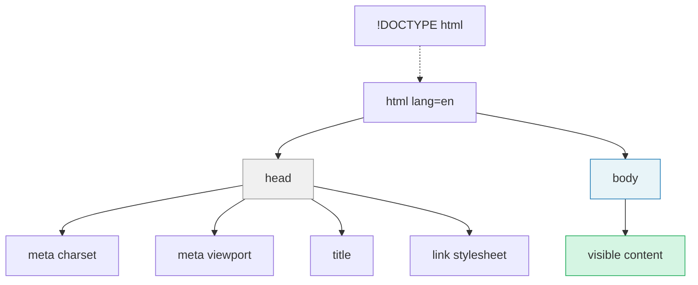

Every HTML page shares the same basic skeleton. Here's the minimum you need:

```html
<!DOCTYPE html>
<html lang="en">
  <head>
    <meta charset="UTF-8">
    <meta name="viewport" content="width=device-width, initial-scale=1.0">
    <title>My Portfolio</title>
    <link rel="stylesheet" href="style.css">
  </head>
  <body>
    <!-- Your visible content goes here -->
  </body>
</html>
```

This is the first time you're seeing elements nested inside other elements, so it helps to see the structure as a tree. Each element "contains" the elements indented below it:



The `<head>` is invisible to visitors. Everything the user actually sees lives inside `<body>`. Let's walk through each piece.

## The doctype

```html
<!DOCTYPE html>
```

This line tells the browser: "This is a modern HTML document." It must be the very first thing in the file. You write it once and never think about it again.

## Attributes

In the skeleton above, you'll have noticed extra information inside several opening tags: `lang="en"`, `charset="UTF-8"`, `href="style.css"`. These are **attributes**. They follow the pattern `name="value"` and provide additional details about the element: where a link goes, what language the page is in, what file to load.

We'll use attributes constantly throughout this guide. Most are self-explanatory in context (`src` is a source, `href` is a hyperlink reference), and I'll explain each one as it comes up. [Chapter 8](/html/attributes/) covers the most important attributes in one place for reference.

## The `<html>` element

```html
<html lang="en">
```

Everything else goes inside the `<html>` element. It's the root of your document.

The `lang` attribute declares the language of the page. This helps screen readers pronounce text correctly and helps search engines serve your page to the right audience. Use `"en"` for English, `"fr"` for French, `"ja"` for Japanese, and so on. For regional variants, add a subtag: `"pt-BR"` for Brazilian Portuguese is distinct from `"pt"` for European Portuguese, and `"en-GB"` is distinct from `"en-US"`. Getting this right matters for screen readers, spell-checkers, and hyphenation. See the [MDN `lang` attribute reference](https://developer.mozilla.org/en-US/docs/Web/HTML/Reference/Global_attributes/lang) for the full list of valid values.

## The `<head>` element

The `<head>` contains information *about* the page that doesn't appear on the page itself. Think of it as the metadata: the behind-the-scenes setup.

```html
<head>
  <meta charset="UTF-8">
  <meta name="viewport" content="width=device-width, initial-scale=1.0">
  <title>My Portfolio</title>
  <link rel="stylesheet" href="style.css">
</head>
```

- `<meta charset="UTF-8">` ensures the browser can display a wide range of characters, from accented letters to emoji.
- `<meta name="viewport" ...>` tells mobile browsers to match the screen's actual width. (The **viewport** is the visible area of the browser window, the rectangle you're looking at right now.) **Without this line, your fluid responsive design will not work on phones.** It's one line of code, but it's critical.
- `<title>` sets the text that appears in the browser tab and in search results.
- `<link rel="stylesheet" href="style.css">` connects your CSS file. The `href` points to the file location, and `rel="stylesheet"` tells the browser what that file is for. The CSS file won't exist yet, and that's fine. We'll create it in the CSS guide.

## The `<body>` element

Everything the visitor actually sees goes inside `<body>`. Text, images, links, navigation: all of it.

```html
<body>
  <h1>Welcome to my portfolio</h1>
  <p>I'm an artist working with oil and digital media.</p>
</body>
```

## A note on nesting and indentation

HTML elements can contain other elements. When they do, we indent the inner elements to show the relationship visually:

```html
<body>
  <header>
    <h1>Site Title</h1>
    <nav>
      <a href="/">Home</a>
      <a href="/work">Work</a>
    </nav>
  </header>
</body>
```

This indentation is purely for readability. The browser doesn't care about it. But you will, two weeks from now when you're trying to figure out where something went wrong.


You'll see paths like `/work` and `/about` throughout this guide. These are *site-relative paths* that point to other pages on a website. They only work when your site is served by a web server (including the Live Preview extension from [Chapter 2](/html/getting-set-up/)). If you're opening your HTML file directly in a browser (with a `file:///` address), these links won't work. That's okay. For now, you can use paths like `work.html` or `about.html` if you want to link to other files in the same folder, or just treat these examples as illustrations of how a finished site would be structured.

