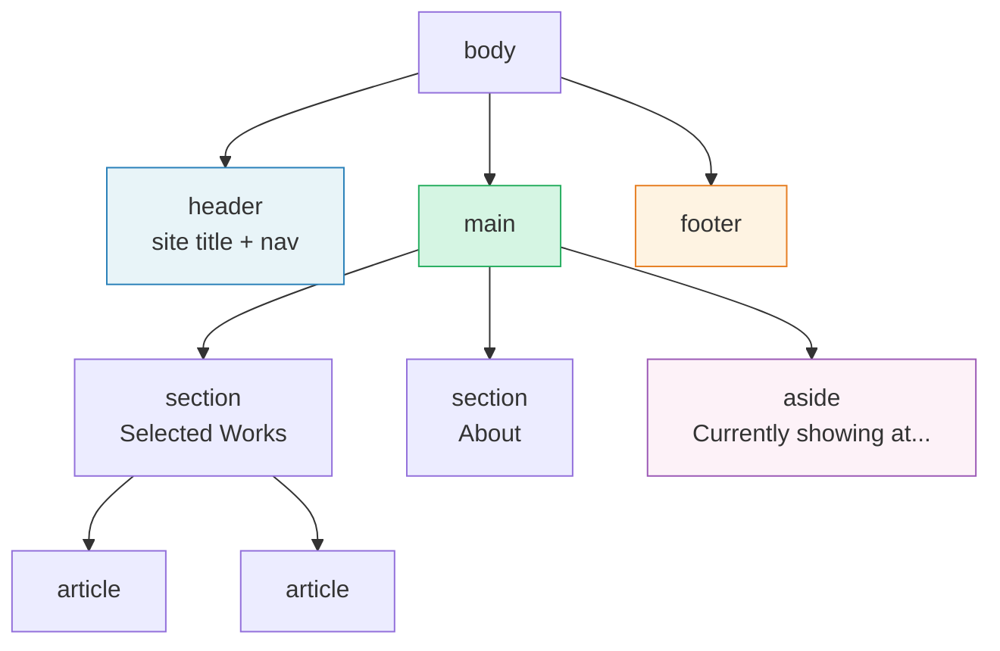

Structural elements give your page its overall shape. They define the large sections that organize your content. If text elements are the individual brush strokes, structural elements are the composition.

## The landmarks

These are the elements that define the major regions of a page. Screen readers and other tools recognize these as landmarks, allowing users to jump directly to them. Here's how a typical artist portfolio page breaks down into landmarks:



And here's what the code looks like:

```html
<body>
  <header>
    <h1><a href="/">Jane Doe</a></h1>
    <nav aria-label="Primary">
      <a href="/work">Work</a>
      <a href="/about">About</a>
      <a href="/contact">Contact</a>
    </nav>
  </header>

  <main>
    <!-- The main content of the page -->
  </main>

  <footer>
    <p>&copy; 2025 Jane Doe. All rights reserved.</p>
  </footer>
</body>
```

**`<header>`** typically contains the site title/logo and primary navigation. Wrapping the site name in `<h1>` gives it the correct heading level. You can also use `<header>` inside an `<article>` or `<section>` to mark the heading area of that particular block of content.

**`<main>`** wraps the primary content of the page. There should only be one `<main>` per page. It excludes things like the site header, footer, and sidebar navigation that repeat across every page.

**`<footer>`** contains information like copyright notices, secondary links, or contact details. Like `<header>`, it can also be used inside other elements.

Here's the landmark code above rendered with construct.css. Every semantic element gets a visible, labeled outline, so you can see exactly where `<header>`, `<main>`, `<section>`, `<article>`, `<aside>`, and `<footer>` live in the page:





**`<nav>`** is for major navigation blocks. Not every group of links needs a `<nav>`, just the primary navigation areas. If you have more than one `<nav>` on a page, give each one an `aria-label` so screen readers can tell them apart (we'll cover `aria-label` properly in the attributes chapter):

```html
<nav aria-label="Primary">...</nav>
<nav aria-label="Social media links">...</nav>
```

## Organizing your content

Inside `<main>`, you'll use these elements to group related content:

**`<section>`:** A thematic grouping of content, usually with its own heading. Note that a `<section>` is only exposed as a navigable landmark to screen readers when it has an accessible name (via `aria-label` or `aria-labelledby`). Without one, assistive technology treats it similarly to a `<div>`:

```html
<section aria-label="Selected Works">
  <h2>Selected Works</h2>
  <!-- artwork grid goes here -->
</section>

<section aria-label="Exhibitions">
  <h2>Exhibitions</h2>
  <!-- exhibition list goes here -->
</section>
```

**`<article>`:** A self-contained piece of content that could stand on its own. If you could syndicate it (share it, repost it, display it in a feed), it's probably an `<article>`.

```html
<article>
  <h2>Notes on Process: The Harbor Series</h2>
  <p>This series began during a residency in Marseille...</p>
</article>
```

A page can contain multiple articles (like a blog listing), and articles can contain sections. Don't overthink the distinction. If in doubt, ask: "Does this content make sense on its own, outside of this page?" If yes, it's an article. If it's a thematic chunk within a larger page, it's a section.

**`<aside>`:** Content that's related to the main content but could be considered separate. Sidebars, pull quotes, related links, or supplementary information.

```html
<aside>
  <h2>Currently showing at</h2>
  <p>Galleri Nord, Stockholm - through April 2025</p>
</aside>
```

## Generic containers: `<div>` and `<span>`

Every element we've covered so far carries meaning. `<div>` and `<span>` are the two exceptions: they are purely structural hooks with **no semantic meaning** at all. You use them when you need a container for styling purposes and no semantic element is appropriate.

**`<div>`** is a block-level container. Meaning it takes up the full width available and starts on a new line, like a paragraph. It's the one you'll reach for when you need a wrapper around a group of elements:

```html
<div class="wrapper">
  <!-- content that needs a max-width constraint -->
</div>
```

**`<span>`** is its inline counterpart. It sits within a line of text without breaking it, like a highlighted word. Use it when you need a styling hook around a word or phrase but no semantic inline element (`<strong>`, `<em>`, etc.) fits:

```html
<p>Available in <span class="color-swatch" style="--swatch: #120A8F">ultramarine</span> and <span class="color-swatch" style="--swatch: #E97451">burnt sienna</span>.</p>
```

The rule of thumb for both: if a more specific element fits, use that instead. Reach for `<div>` and `<span>` last.

This demo shows the same content twice: once built entirely with `<div>` elements, and once with proper semantic HTML. With construct.css rendering both, the semantic version has labeled outlines (`header`, `nav`, `main`, `footer`) while the `<div>` version shows only anonymous boxes. The argument for semantic HTML stops being theoretical when you can see it:




