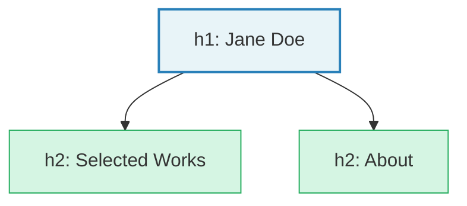

I introduced attributes briefly in [Chapter 3](/html/first-html-page/): extra information inside an element's opening tag, following the pattern `name="value"`. You've been using them throughout this guide. Now let's look at the specific attributes you'll reach for most often.

**`class`** is your primary hook for CSS styling. An element can have multiple classes, separated by spaces:

```html
<div class="wrapper flow">
  <h2 class="section-title">Selected Works</h2>
</div>
```

**`id`** is a unique identifier. No two elements on the same page should share an `id`. It's useful for in-page navigation:

```html
<section id="work">
  <h2>Selected Works</h2>
</section>

<!-- Somewhere else on the page -->
<a href="#work">Jump to my work</a>
```

**`data-*` attributes** let you attach custom information to elements. We'll see these used heavily in the CSS guide for handling exceptions in the CUBE CSS methodology, but for now, here's what they look like in the markup:

```html
<section data-theme="dark">
  <h2>Night Series</h2>
</section>

<section data-theme="light">
  <h2>Watercolors</h2>
</section>
```

**`aria-label`** provides an accessible name when the visual context alone isn't enough. This is the attribute we used earlier to distinguish multiple `<nav>` elements, but it's useful anywhere the visible text doesn't fully describe the element's purpose:

```html
<button aria-label="Close gallery overlay">×</button>
<a href="/work/harbor-study" aria-label="View Harbor Study No. 3">
  
</a>
```

Note that `aria-label` on a link *overrides* the accessible name that would otherwise come from its contents (including any image `alt` text). When using `aria-label` on a link, set the image's `alt` to empty (`alt=""`) to avoid redundancy. If the image's `alt` text is already sufficient as a link description, you can omit the `aria-label` entirely.

## The document as a whole

Before we move on to CSS, take a step back and look at a small but complete page. Every element chosen for its meaning, every attribute adding necessary information:

```html
<!DOCTYPE html>
<html lang="en">

<head>
  <meta charset="UTF-8">
  <meta name="viewport" content="width=device-width, initial-scale=1.0">
  <title>Jane Doe - Artist</title>
  <link rel="stylesheet" href="style.css">
</head>

<body>
  <header>
    <h1><a href="/">Jane Doe</a></h1>
    <nav aria-label="Primary">
      <a href="/work">Work</a>
      <a href="/about">About</a>
      <a href="/contact">Contact</a>
    </nav>
  </header>

  <main>
    <section id="selected-works" aria-label="Selected Works">
      <h2>Selected Works</h2>

      <article>
        <figure>
          
          <figcaption>Harbor Study No. 3 - Oil on panel, 30 × 40 cm, <time datetime="2025">2025</time></figcaption>
        </figure>
      </article>

      <article>
        <figure>
          
          <figcaption>Night Garden - Acrylic on canvas, 100 × 75 cm, <time datetime="2024">2024</time></figcaption>
        </figure>
      </article>
    </section>

    <section id="about" aria-label="About">
      <h2>About</h2>
      <p>I'm a painter based in Stockholm, working primarily in oil and acrylic. My work explores the boundary between
        observation and memory.</p>

      <details>
        <summary>Exhibition history</summary>
        <dl>
          <dt><time datetime="2025">2025</time></dt>
          <dd>Galleri Nord, Stockholm - Solo show</dd>

          <dt><time datetime="2024">2024</time></dt>
          <dd>Open Studio, Malmö - Group exhibition</dd>
        </dl>
      </details>
    </section>
  </main>

  <footer>
    <p>&copy; 2025 Jane Doe</p>
    <nav aria-label="Social media links">
      <a href="https://instagram.com/janedoe">Instagram</a>
    </nav>
  </footer>
</body>

</html>
```

Without a single line of CSS, this document communicates its structure clearly. A screen reader can navigate it. A search engine can index it. And when we add CSS, we have clean, meaningful markup to build on.

Here's this complete portfolio page rendered with construct.css. Every semantic element is labeled and visible. This is the structure you've been building toward across all eight chapters:





Remember the "table of contents test" from [Chapter 4](/html/text-and-content/)? Pull out just the headings from this page and they form a clear outline:



A sensible, two-level outline. No skipped levels, one clear `<h1>`, logical groupings. If your headings pass this test, your document structure is solid.

That's the goal of good HTML: a solid, honest foundation for everything that follows.

## What I didn't cover: forms

You may have noticed that this guide doesn't cover HTML forms (contact forms, email sign-ups, and the like). Forms involve a substantial set of elements (`<form>`, `<label>`, `<input>`, `<textarea>`, `<select>`) and their own accessibility considerations. More importantly, a form doesn't actually *do* anything without a server or a third-party service to receive the submission, which is outside the scope of an HTML and CSS guide.

For a portfolio site, a `mailto:` link or a link to your social profiles will serve you well to start. If you use a `mailto:` link, make the link text descriptive (like "Get in touch" or "Email me") rather than displaying a raw email address, which is harder for screen readers to parse and easier for spam scrapers to harvest. When you're ready to add a contact form, the [MDN Web Forms Guide](https://developer.mozilla.org/en-US/docs/Learn/Forms) is thorough and well-structured, and services like [Formspree](https://formspree.io/) or [Netlify Forms](https://docs.netlify.com/forms/setup/) handle the server side for you.

## Accessibility checklist

Before you move on to CSS, run through this quick check. Everything here is a practical application of what you've already learned in this guide.

- Does every content image have descriptive `alt` text? (Decorative images should have `alt=""`.)
- Do your headings follow a logical hierarchy (`h1` then `h2` then `h3`, no skipped levels)?
- Is there only one `<h1>` per page?
- Does the page use landmark elements (`<header>`, `<main>`, `<nav>`, `<footer>`) rather than generic `<div>`s for major sections?
- If there's more than one `<nav>`, does each have a distinct `aria-label`?
- Does every `` have `width` and `height` attributes to prevent layout shifts?
- Does the `<html>` element have a `lang` attribute?
- Does link text make sense on its own, without the surrounding sentence?

None of these require testing tools. Just read through your HTML and check. We'll later cover how to verify color contrast and test with screen readers, but this list will catch the most common structural issues before you get there.

## You now have a complete foundation

With what you've learned in these eight chapters, you can build a well-structured, accessible, meaningful web page from scratch. Not a page that *looks* finished (that's CSS's job), but one that *works*: a page a screen reader can navigate, a search engine can understand, and your future self can maintain. That's not a small thing. Most of the web is built on shaky HTML. Yours won't be.

**Next up:** CSS, where we bring this structure to life.
