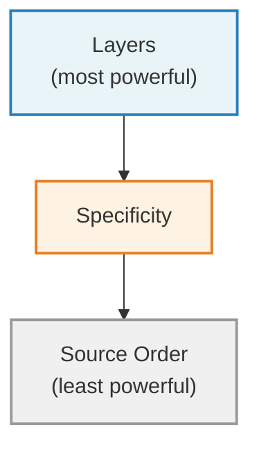
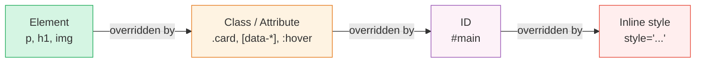

CSS (Cascading Style Sheets) is the language that controls how your HTML looks. Color, typography, spacing, layout, animation: it's all CSS. But before you start writing style rules, it helps to understand how the language _thinks_. CSS has a few core mechanisms that determine which styles get applied and why.

## Linking CSS to HTML

You can write CSS in a separate file and link it to your HTML (this is the most common approach):

```html
<link rel="stylesheet" href="style.css" />
```

Or you can write CSS directly in your HTML file within a `<style>` element:

```html
<style>
  body {
    color: #333;
  }
</style>
```

For any real project, use a separate file. It keeps things organized and lets multiple HTML pages share the same styles.

## Anatomy of a CSS rule

```css
selector {
  property: value;
}
```

A real example:

```css
h1 {
  color: darkslateblue;
  font-size: 2rem;
}
```

This says: "Find every `<h1>` element and make its text color dark slate blue with a font size of 2rem." (Don't worry about what `rem` means yet, it's a unit of measurement I'll explain properly in [Chapter 14](/css/typography/). For now, just know that `2rem` means "twice the base text size.")

An interactive playground where you can change the selector, property, and value of a CSS rule and see the result update in real time. (Uses JavaScript for the interactive controls.)





## Selectors

Selectors are how you tell CSS _what_ to style. Here are the ones you'll use most often:

**Element selectors** target HTML elements directly:

```css
p {
  line-height: 1.6;
}

img {
  max-width: 100%;
}
```

**Class selectors** target elements with a specific class. They start with a dot:

```css
.wrapper {
  max-width: 60rem;
  margin-inline: auto;
}
```

```html
<div class="wrapper">
  <!-- content constrained to 60rem -->
</div>
```

**Attribute selectors** target elements based on their attributes:

```css
[data-theme="dark"] {
  background: #1a1a1a;
  color: #f0f0f0;
}
```

**Combinators** let you target elements based on their relationship to others:

```css
/* Direct children of .card */
.card > h2 {
  font-size: 1.25rem;
}

/* Any descendant of .card */
.card h2 {
  font-size: 1.25rem;
}

/* Adjacent sibling: an element immediately after another */
h2 + p {
  font-size: 1.1rem;
}
```

**Pseudo-classes** target elements based on state:

```css
a:hover {
  color: darkorchid;
}

a:focus-visible {
  outline: 2px solid currentColor;
  outline-offset: 2px;
}

/* First child in a group */
li:first-child {
  font-weight: bold;
}
```

## Modern selectors

CSS has gained some powerful selectors in recent years that simplify your code significantly.

**`:is()` and `:where()`** let you group selectors concisely. They do the same thing, with one key difference we'll get to in a moment:

```css
/* Instead of this */
article h2,
article h3,
article h4 {
  line-height: 1.2;
}

/* You can write this */
article :is(h2, h3, h4) {
  line-height: 1.2;
}
```

**`:has()`** is sometimes called the "parent selector" because it lets you style an element based on what it _contains_:

```css
/* A figure that contains a figcaption gets extra padding */
figure:has(figcaption) {
  padding-block-end: 1rem;
}

/* A card that contains an image gets different layout */
.card:has(img) {
  display: grid;
  grid-template-rows: auto 1fr;
}
```

## CSS nesting

Modern CSS supports nesting, which lets you write related styles in a grouped, hierarchical way:

```css
.card {
  padding: 1rem;
  border-radius: 0.5rem;

  h2 {
    font-size: 1.25rem;
  }

  p {
    color: gray;
  }

  &:hover {
    box-shadow: 0 2px 8px rgb(0 0 0 / 0.1);
  }
}
```

The `&` refers to the parent selector. This is especially useful for pseudo-classes and pseudo-elements. Without nesting, the code above would be:

```css
.card {
  padding: 1rem;
  border-radius: 0.5rem;
}

.card h2 {
  font-size: 1.25rem;
}

.card p {
  color: gray;
}

.card:hover {
  box-shadow: 0 2px 8px rgb(0 0 0 / 0.1);
}
```

Nesting keeps related styles together and reduces repetition. Both versions above produce exactly the same result; nesting is purely a code organization tool. Use it when it helps readability, but don't nest too deeply. Two or three levels is usually the limit before things get hard to follow.

## The cascade

The "C" in CSS stands for "Cascading." The cascade is the set of rules CSS uses to decide which styles win when multiple rules target the same element. There are three levels to think about, from most powerful to least:



### 1. Layers (most powerful)

CSS `@layer` lets you define explicit ordering for groups of styles. Within the same origin and importance level, styles in a later layer beat styles in an earlier layer, regardless of specificity. In [Chapter 18](/css/cube-css/), I'll introduce a methodology called CUBE CSS that gives each layer a specific role (reset, global styles, layout, components, utilities, exceptions). For now, here's what the syntax looks like:

```css
@layer reset, global, composition, block, utility, exception;
```

Any style in the `exception` layer will beat any style in the `utility` layer, no matter how specific the utility selector is. This is the most powerful tool for managing your cascade.

If you'd like to explore cascade layers further, Miriam Suzanne's [A Complete Guide to CSS Cascade Layers](https://css-tricks.com/css-cascade-layers/) on CSS-Tricks is the definitive resource. And for a visual breakdown of how layers, specificity, and the cascade interact, check out [The Cascade](https://cascade.arpit.codes/) by Arpit Agrawal.

### 2. Specificity

Within the same layer (or when you're not using layers), specificity determines which rule wins. Here's the ranking from lowest to highest:



Here's the simple mental model:

- Element selectors (`p`, `h1`, `img`) have the lowest specificity
- Class selectors (`.card`, `.wrapper`), attribute selectors (`[data-theme]`), and pseudo-classes (`:hover`) are more specific
- ID selectors (`#main`) are more specific still
- Inline styles (`style="..."` directly on the element) beat everything except `!important`

When two rules have equal specificity, the one that comes later in your code wins.

Here's the difference between `:is()` and `:where()` I mentioned earlier: `:is()` takes on the specificity of its most specific argument, while `:where()` always has zero specificity. This makes `:where()` perfect for default styles you want to be easy to override.

### 3. Source order (least powerful)

If two rules have the same layer and the same specificity, the one written later wins.

That's it. Layers > Specificity > Source order. You don't need to memorize a point system. If your styles are organized into layers (which CUBE will help you do), specificity conflicts become rare.

A quick note on `!important`: it exists, and it overrides normal specificity. But if you find yourself using it, it's almost always a sign that something in your cascade is disorganized. One nuance worth knowing: `!important` declarations _reverse_ the layer order. An `!important` rule in the `reset` layer beats an `!important` rule in the `exception` layer. This is by design: it lets low-priority layers enforce critical overrides (like the `prefers-reduced-motion` reset we'll see in [Chapter 19](/css/transitions/)). Outside of that kind of use case, avoid `!important`.

## Inheritance

Some CSS properties pass down from parent elements to their children automatically. The most common inherited properties are text-related: `color`, `font-family`, `font-size`, `line-height`, `text-align`.

This is incredibly useful. It means you can set your base typography on the `body` and have it flow through your entire page:

```css
body {
  font-family: "Georgia", serif;
  color: #2a2a2a;
  line-height: 1.6;
}
```

Every paragraph, heading, list item, and link inside `<body>` will inherit these values unless you explicitly override them. This is the cascade _working for you_.

Layout properties like `padding`, `margin`, `border`, `display`, and `background` are _not_ inherited, because it would be chaos if every child had the same padding as its parent.

## CSS resets

Before you start writing your own styles, it helps to start from a consistent baseline. Different browsers have slightly different default styles (margins, padding, font sizes), and a CSS reset normalizes these differences.

Here are three approaches I think are worth knowing about:

**Josh Comeau's Custom CSS Reset** is thorough and well-explained. Every rule comes with a detailed writeup of _why_ it exists, making it an excellent learning resource. Josh's advice is that you should own your reset and evolve it over time.

Read and copy it from: [joshwcomeau.com/css/custom-css-reset](https://www.joshwcomeau.com/css/custom-css-reset/)

**Andy Bell's "(more) Modern CSS Reset"** is more targeted and minimal. It's designed to take a lighter touch that preserves some useful browser defaults while still normalizing the inconsistencies.

Read and copy it from: [piccalil.li/blog/a-more-modern-css-reset](https://piccalil.li/blog/a-more-modern-css-reset/)

**modern-normalize** by Sindre Sorhus takes a different philosophy: rather than stripping defaults, it tweaks and corrects them for cross-browser consistency. It's the most comprehensive of the three, touching font stacks, form elements, table borders, and many small rendering quirks. Good if you want browsers to agree with each other without starting from a blank slate.

Find it at: [github.com/sindresorhus/modern-normalize](https://github.com/sindresorhus/modern-normalize)

For this guide, I recommend starting with Josh Comeau's reset. It's a great learning tool because every rule is explained in detail, and it strips all default margins (except on `<dialog>`), so the `.flow` utility I'll introduce in the next chapter becomes the sole source of vertical spacing. Andy Bell's reset strips margins on a curated list of elements (`body, h1, h2, h3, h4, p, figure, blockquote, dl, dd`) rather than universally, so some browser defaults remain. Josh's gives you a fully clean slate. But the underlying principle is the same regardless of which you pick: understand what it does, and make it yours.

Your reset will live in the `reset` layer, which we'll set up properly in the CUBE chapter:

```css
@layer reset {
  /* Your chosen reset goes here */
}
```
