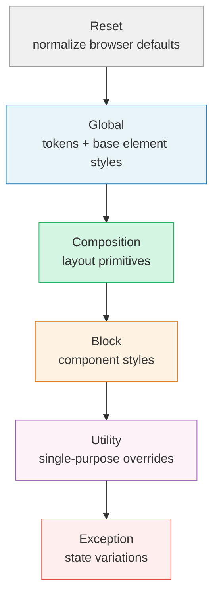

You've now learned the individual pieces: the cascade, custom properties, color, typography, fluid scales, flexbox, and grid. CUBE CSS is the methodology that organizes all of these into a coherent, maintainable system.

Here's the problem it solves. Imagine you've written 200 lines of CSS for your portfolio. Your headings are styled, your cards look good, your gallery works. Then you want to add a dark-themed section, and suddenly your card headings are the wrong color because a style you wrote earlier is overriding the one you just added. You fix that with a more specific selector, but now your navigation links have changed too. You're playing whack-a-mole with your own stylesheet. This is what happens without a system. CUBE gives each kind of style a clear home, so they don't step on each other.

CUBE stands for **Composition Utility Block Exception**. And the "CSS" in the name is intentional: this methodology is an *extension* of CSS, not a replacement. It works *with* the cascade and inheritance, rather than fighting against them.

## The philosophy

Most of the styling work in CUBE CSS happens at a high level: global styles, fluid scales, and shared compositions. By the time you get down to individual components ("blocks"), there's very little left to do. Your global styles handle typography and color. Your compositions handle layout. A "card" block might only need a border-radius and a shadow. Everything else is already taken care of.

## The `@layer` stack

The six CUBE layers form a vertical stack of increasing priority. Each layer has a specific role:



`@layer` gives the CUBE system a native enforcement mechanism in the cascade. Declare your layers at the top of your stylesheet:

```css
@layer reset, global, composition, block, utility, exception;
```

This single line establishes the order. Styles in `reset` have the lowest priority. Styles in `exception` have the highest. Within each layer, normal specificity rules apply. But a class in the `exception` layer will always override a class in the `utility` layer, regardless of selector complexity.

This means you no longer need to worry about specificity battles between your layout utilities and your component styles. The layers handle it.

## Layer 1: Reset

Your chosen CSS reset goes here. I'm using Josh Comeau's Custom CSS Reset, which strips all default margins and gives us a clean slate for `.flow` to work with. You don't need to understand every line right now, each rule is documented in detail on [Josh's site](https://www.joshwcomeau.com/css/custom-css-reset/), and you can study them as your knowledge grows:

```css
@layer reset {
  /* 1. Use a more-intuitive box-sizing model */
  *,
  *::before,
  *::after {
    box-sizing: border-box;
  }

  /* 2. Remove default margin */
  *:not(dialog) {
    margin: 0;
  }

  /* 3. Allow animating size keywords like auto and fit-content */
  @media (prefers-reduced-motion: no-preference) {
    html {
      interpolate-size: allow-keywords;
    }
  }

  body {
    /* 4. Add accessible line-height */
    line-height: 1.5;
    /* 5. Improve text rendering */
    -webkit-font-smoothing: antialiased;
  }

  /* 6. Improve media defaults */
  img, picture, video, canvas, svg {
    display: block;
    max-width: 100%;
  }

  /* 7. Inherit fonts for form controls */
  input, button, textarea, select {
    font: inherit;
  }

  /* 8. Avoid text overflows */
  p, h1, h2, h3, h4, h5, h6 {
    overflow-wrap: break-word;
  }

  /* 9. Improve line wrapping */
  p {
    text-wrap: pretty;
  }
  h1, h2, h3, h4, h5, h6 {
    text-wrap: balance;
  }

  /* 10. Create a root stacking context (React/Next.js specific, safe to omit for plain HTML) */
  #root, #__next {
    isolation: isolate;
  }
}
```

## Layer 2: Global

Global styles set your design tokens and apply them at the highest level. This is where the cascade does most of the heavy lifting:

```css
@layer global {
  :root {
    /* Colors */
    --color-ink: oklch(20% 0.02 264);
    --color-paper: oklch(97% 0.005 264);
    --color-primary: oklch(30% 0.19 268);
    --color-accent: oklch(69% 0.15 37);

    --color-bg: var(--color-paper);
    --color-text: var(--color-ink);
    --color-heading: var(--color-primary);
    --color-link: var(--color-accent);

    /* Typography */
    --font-heading: "Playfair Display", serif;
    --font-body: "Verdana", sans-serif;

    /* Fluid type scale (from Utopia) */
    --step--1: clamp(0.8rem, 0.73rem + 0.33vw, 1rem);
    --step-0: clamp(1rem, 0.87rem + 0.56vw, 1.33rem);
    --step-1: clamp(1.25rem, 1.03rem + 0.88vw, 1.78rem);
    --step-2: clamp(1.56rem, 1.21rem + 1.31vw, 2.37rem);
    --step-3: clamp(1.95rem, 1.41rem + 1.89vw, 3.16rem);
    --step-4: clamp(2.44rem, 1.63rem + 2.68vw, 4.21rem);

    /* Fluid space scale (from Utopia) */
    --space-xs: clamp(0.75rem, 0.65rem + 0.47vw, 1.04rem);
    --space-s: clamp(1rem, 0.87rem + 0.56vw, 1.33rem);
    --space-m: clamp(1.5rem, 1.3rem + 0.84vw, 2rem);
    --space-l: clamp(2rem, 1.74rem + 1.13vw, 2.67rem);
    --space-xl: clamp(3rem, 2.61rem + 1.69vw, 4rem);
    --space-2xl: clamp(4rem, 3.48rem + 2.25vw, 5.33rem);
  }

  body {
    font-family: var(--font-body);
    font-size: var(--step-0);
    color: var(--color-text);
    background: var(--color-bg);
    line-height: 1.6;
  }

  h1, h2, h3, h4 {
    font-family: var(--font-heading);
    color: var(--color-heading);
    line-height: 1.1;
  }

  h1 { font-size: var(--step-4); }
  h2 { font-size: var(--step-3); }
  h3 { font-size: var(--step-2); }
  h4 { font-size: var(--step-1); }

  a {
    color: var(--color-link);
  }

  p {
    max-width: 65ch;
  }
}
```

At this point, with no layout or component styles at all, your page already looks good. The typography is scaled, the colors are set, and the spacing is fluid. This is the CUBE philosophy in action: the browser and your global styles do most of the work.

## Layer 3: Composition

The composition layer handles layout at a structural level. These are reusable layout primitives that don't care what content is inside them.

```css
@layer composition {
  /* Flow: vertical rhythm between sibling elements */
  .flow > * + * {
    margin-block-start: var(--flow-space, var(--space-s));
  }

  /* Wrapper: constrained, centered content area */
  .wrapper {
    max-width: 60rem;
    margin-inline: auto;
    padding-inline: var(--space-m);
  }

  /* Cluster: horizontal group that wraps naturally */
  .cluster {
    display: flex;
    flex-wrap: wrap;
    gap: var(--space-s);
    align-items: center;
  }

  /* Grid: fluid responsive grid */
  .grid {
    display: grid;
    grid-template-columns: repeat(
      auto-fit,
      minmax(min(100%, var(--grid-min-item-size, 15rem)), 1fr)
    );
    gap: var(--grid-gap, var(--space-m));
  }

  /* Sidebar: a layout with a fixed-width sidebar and flexible main area */
  .with-sidebar {
    display: flex;
    flex-wrap: wrap;
    gap: var(--space-l);
  }

  .with-sidebar > :first-child {
    flex-basis: 15rem;
    flex-grow: 1;
  }

  .with-sidebar > :last-child {
    flex-basis: 0;
    flex-grow: 999;
    min-width: 60%;
  }
}
```

Notice how the `.grid` composition uses a custom property `--grid-min-item-size`. This means you can adjust the grid's behavior in context without creating a new class:

```html
<div class="grid" style="--grid-min-item-size: 20rem;">
  <!-- larger minimum item size for this particular grid -->
</div>
```

The `.with-sidebar` composition assumes exactly two children. If you need a more robust version that handles varying numbers of children, see the [Sidebar layout in Every Layout](https://every-layout.dev/layouts/sidebar/), which covers edge cases and alternative approaches.

The composition layer is about *skeletons*. It controls how things sit relative to each other, but it says nothing about how they look (colors, borders, shadows). You can put any component inside a `.flow` or a `.grid` and it will be laid out correctly.

## Layer 4: Block

A block is a component: a card, a button, a navigation bar. In CUBE, block styles are *small* because the global styles and compositions have already done most of the work.

You'll notice I use a naming convention like `.card__image` for child elements of a block. This comes from a methodology called **BEM (Block Element Modifier)**, where the double underscore signals "this element belongs to this block." It's a common convention, but CUBE doesn't require it. You could just as comfortably use flat selectors or target HTML elements directly:

```css
/* BEM-style (what I use in this guide) */
.card__image { }

/* Flat class selector */
.card .image { }

/* HTML element selector */
.card img { }
```

It shouldn't really matter, because your global CSS, utilities, and composition rules are doing the hard work for you already. Pick whichever style feels clearest to you.

```css
@layer block {
  .card {
    border-radius: 0.5rem;
    overflow: hidden;
    background: var(--color-bg);
    box-shadow: 0 1px 3px oklch(0% 0 0 / 0.1);
  }

  .card__image {
    width: 100%;
    aspect-ratio: 4 / 3;
    object-fit: cover;
  }

  .card__content {
    padding: var(--space-m);
  }

  .button {
    display: inline-flex;
    padding: var(--space-xs) var(--space-m);
    background: var(--color-primary);
    color: var(--color-paper);
    border: none;
    border-radius: 0.25rem;
    font: inherit;
    font-weight: 600;
    cursor: pointer;
    text-decoration: none;
  }

  .site-header {
    padding-block: var(--space-m);
    border-block-end: 1px solid oklch(0% 0 0 / 0.1);
  }
}
```

Notice how little CSS each block needs. The `.card` doesn't set font sizes, colors, or spacing between its child elements. That's all inherited from the global layer or handled by composing it with `.flow`:

```html
<article class="card">
  
  <div class="[ card__content ] [ flow ]">
    <h3>Harbor Study No. 3</h3>
    <p>Oil on panel, 30 × 40 cm</p>
    <a href="/work/harbor-study" class="button">View details</a>
  </div>
</article>
```

## Layer 5: Utility

Utility classes do one thing well. They're small, reusable, and apply a single style or a tightly related group of styles. Utilities sit *above* blocks in the layer order because their purpose is to override block styles when needed. If you add `.bg-dark` to a `.card`, you want the utility to win decisively.

```css
@layer utility {
  /* Visually hidden but accessible to screen readers */
  .visually-hidden {
    clip: rect(0 0 0 0);
    clip-path: inset(50%);
    height: 1px;
    overflow: hidden;
    position: absolute;
    white-space: nowrap;
    width: 1px;
  }

  /* Text alignment */
  .text-center { text-align: center; }

  /* Font family overrides */
  .font-heading { font-family: var(--font-heading); }
  .font-body { font-family: var(--font-body); }

  /* Color utilities */
  .color-primary { color: var(--color-primary); }
  .color-accent { color: var(--color-accent); }
  .bg-primary { background-color: var(--color-primary); }
  .bg-dark {
    background-color: var(--color-ink);
    color: var(--color-paper);
  }
}
```

Keep your utility classes minimal. You don't need hundreds of them. Create only the ones your project actually uses. Notice how they reference the custom properties you've already defined, which keeps everything connected to your design system.

## Layer 6: Exception

Exceptions are small variations to a block, applied with `data-*` attributes. They represent *states* or *deviations* from the default.

```css
@layer exception {
  .card[data-layout="featured"] {
    grid-column: 1 / -1;
  }

  .card[data-layout="reversed"] {
    display: flex;
    flex-direction: column-reverse;
  }

  .button[data-variant="outline"] {
    background: transparent;
    color: var(--color-primary);
    border: 2px solid currentColor;
  }

  [data-theme="dark"] {
    --color-bg: var(--color-ink);
    --color-text: var(--color-paper);
    --color-heading: var(--color-paper);
  }
}
```

```html
<article class="card" data-layout="featured">
  <!-- A card that spans the full width of the grid -->
</article>

<section data-theme="dark">
  <!-- This section and everything inside it uses the dark palette -->
</section>
```

Using `data-*` attributes (instead of modifier classes) makes exceptions visually distinct in the HTML. When you scan the markup, you can immediately see: "This is a `.card`, but it has an exception." The separation between the component identity (class) and its state (data attribute) is clear.

## The bracket grouping convention

When an element has multiple classes from different CUBE layers, Andy Bell suggests grouping them with square brackets for clarity:

```html
<article class="[ card ] [ flow ] [ bg-dark ]" data-layout="featured">
```

The groups follow this order:

1. Block class(es)
2. Composition and layout class(es)
3. Utility class(es)

The brackets are cosmetic. HTML and CSS ignore them. But they make it instantly clear which classes serve which purpose. If you find the brackets distracting, pipes work too:

```html
<article class="card | flow | bg-dark" data-layout="featured">
```

## A complete stylesheet structure

Here's what a full project stylesheet looks like using CUBE CSS and `@layer`:

```css
/* === Layer order declaration === */
@layer reset, global, composition, block, utility, exception;

/* === Reset === */
@layer reset {
  /* Your reset here (Andy Bell's, Josh Comeau's, etc.) */
}

/* === Global === */
@layer global {
  :root {
    /* Design tokens: colors, fonts, fluid scales */
  }

  /* Base element styles */
}

/* === Composition === */
@layer composition {
  /* Layout primitives: .flow, .wrapper, .grid, .cluster, .with-sidebar */
}

/* === Block === */
@layer block {
  /* Component styles: .card, .button, .site-header, .site-footer */
}

/* === Utility === */
@layer utility {
  /* Single-purpose helpers: .visually-hidden, .text-center, color/bg utilities */
}

/* === Exception === */
@layer exception {
  /* State variations: [data-theme], [data-layout], [data-variant] */
}
```

That's it. Every rule has a clear home. The cascade is managed for you. And the system encourages you to write *less* CSS, not more, because each layer builds on the layers before it.

## Splitting layers into separate files

As your project grows, keeping all your CSS in a single file becomes unwieldy. A practical approach is to split each layer into its own file and use `@import` with `layer()` to pull them together. Your main `styles.css` might look like this:

```css
@layer reset, global, composition, block, utility, exception;

@import "reset.css" layer(reset);
@import "global.css" layer(global);
@import "composition.css" layer(composition);
@import "block.css" layer(block);
@import "utility.css" layer(utility);
@import "animation.css" layer(utility);
@import "exception.css" layer(exception);
```

The first line declares the layer order upfront, so the cascade priority is clear regardless of import order. Each file contains only the CSS for its layer, making it easy to find and maintain. You can even import multiple files into the same layer (like `animation.css` into `utility` above).

## Learning more about CUBE CSS

This chapter covered enough of CUBE to build a real project, but the methodology has more depth than I've explored here. Andy Bell's original blog post walks through the thinking behind each layer with additional examples, and the full documentation covers principles, grouping conventions, and edge cases in more detail.

- [piccalil.li/blog/cube-css/](https://piccalil.li/blog/cube-css/) - Andy Bell's original blog post introducing the methodology
- [cube.fyi](https://cube.fyi/) - the full documentation

## The file structure

A portfolio project using CUBE CSS and split layers might look like this:

```txt
portfolio/
├── index.html
├── style.css           <- layer declarations and @imports
├── css/
│   ├── reset.css
│   ├── global.css      <- tokens, base element styles
│   ├── composition.css <- .flow, .wrapper, .grid, .cluster
│   ├── block.css       <- .card, .button, .site-header
│   ├── utility.css     <- .visually-hidden, .text-center
│   └── exception.css   <- [data-theme], [data-layout]
└── images/
```

Your `style.css` is just the layer order and imports, no actual rules. Each file has a single responsibility.
