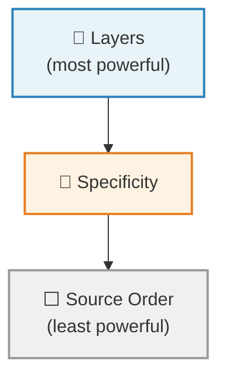
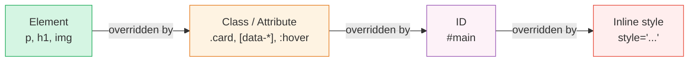
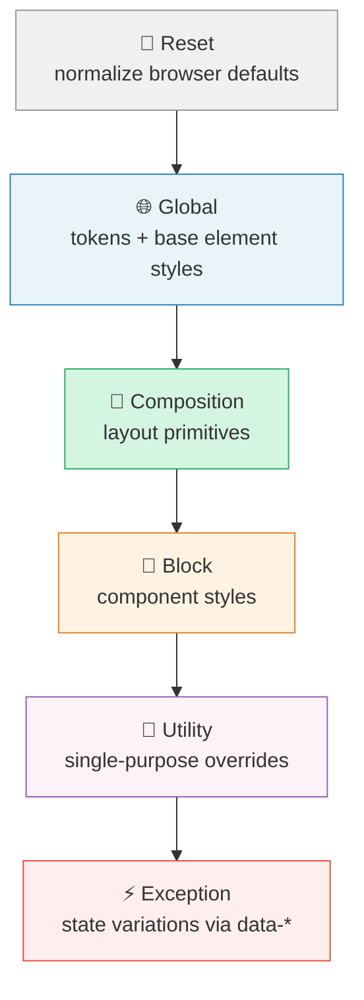

# Modern CSS for Artists

*This is Part 2 of a two-part guide. It covers CSS (Chapters 9-20) and picks up where Modern HTML for Artists (Chapters 1-8) left off. You'll get more out of this guide if you've read Part 1.*

## Chapter 9: CSS and the Fluid Canvas

As an artist, you're used to working on a fixed canvas. A sheet of watercolor paper is 22 x 30 inches. A digital canvas in Procreate can be 4096 × 4096 pixels. You control every millimeter, every pixel. Nothing moves unless you move it.

The web is not like that.

A website might be viewed on a phone held in portrait, a widescreen monitor, a tablet in landscape, a screen reader that doesn't "see" anything at all, or a browser window that someone has resized to half their screen while they watch a video on the other half. You don't know the dimensions. You don't know the device. You don't even know if the person can see.

This might feel like losing control. It's actually the opposite.

### Content is like water

There's an illustration by Stéphanie Walter (originally based on a quote adapted by Josh Clark from Bruce Lee): "You put water into a cup, it becomes the cup. You put water into a bottle, it becomes the bottle. You put it in a teapot, it becomes the teapot."

<figure>
  
  <figcaption>Illustration by <a href="https://stephaniewalter.design/">Stéphanie Walter</a>, <a href="https://commons.wikimedia.org/w/index.php?curid=68705623">CC BY-SA 3.0</a></figcaption>
</figure>

This is how content on the web works. Your text, your images, your layout: they flow into whatever container they find themselves in. A paragraph doesn't have a fixed width. It fills the space available to it. An image can shrink or grow. A grid of artwork can show four columns or two columns or one, depending on how much room there is.

The old approach to web design fought against this. Designers would pick three or four screen sizes (phone, tablet, desktop) and build a separate layout for each, snapping between them at fixed breakpoints. This meant you were really designing three separate fixed-canvas layouts and stitching them together.

The modern approach embraces the fluid nature of the web. Instead of designing for specific sizes, you establish *relationships* and *proportions*, then let the browser figure out the details. Your font sizes scale smoothly between a minimum and maximum. Your spacing breathes. Your layouts reflow when they need to, based on their content and available space, not because a breakpoint told them to.

### Be the browser's mentor, not its micromanager

This phrase comes from Andy Bell, and it captures the philosophy perfectly. The browser is incredibly good at layout. It has been solving text-reflow and content-fitting problems for decades. When you write rigid, pixel-perfect CSS, you're overriding that intelligence. When you write flexible, hint-based CSS, you're collaborating with it.

Think of it this way: you're not painting the final piece. You're setting up a system of rules, proportions, and relationships. The browser then renders the final piece, differently for every person, but always following your system.

This is a different kind of creative control. Not less control. Different control. And for many artists, once the shift clicks, it actually feels more natural than the fixed-canvas approach. You're designing a *system*, not a *snapshot*.

### There is no "correct" size

One more mental shift before we start writing CSS: there is no best way to view your website. Your site on a phone is not a compromised version of the "real" site on a desktop. Both are equally valid. Every size, every device, every context is a first-class experience.

If you'd like to explore this philosophy more deeply, Jeremy Keith's free online book [Resilient Web Design](https://resilientwebdesign.com/) is a beautifully written history of these ideas. It's short, and it reframes how you think about the web as a medium. Andy Bell's [Build Excellent Websites](https://buildexcellentwebsit.es/) distills the practical principles into a concise reference.

Now let's learn the medium.

## Chapter 10: How CSS Works

CSS (Cascading Style Sheets) is the language that controls how your HTML looks. Color, typography, spacing, layout, animation: it's all CSS. But before you start writing style rules, it helps to understand how the language *thinks*. CSS has a few core mechanisms that determine which styles get applied and why.

### Linking CSS to HTML

You can write CSS in a separate file and link it to your HTML (this is the most common approach):

```html
<link rel="stylesheet" href="style.css">
```

Or you can write CSS directly in your HTML file within a `<style>` element:

```html
<style>
  body {
    color: #333;
  }
</style>
```

For any real project, use a separate file. It keeps things organized and lets multiple HTML pages share the same styles.

### Anatomy of a CSS rule

```css
selector {
  property: value;
}
```

A real example:

```css
h1 {
  color: darkslateblue;
  font-size: 2rem;
}
```

This says: "Find every `<h1>` element and make its text color dark slate blue with a font size of 2rem." (Don't worry about what `rem` means yet, it's a unit of measurement I'll explain properly in Chapter 14. For now, just know that `2rem` means "twice the base text size.")

> **Live demo:** An interactive playground where you can change the selector, property, and value of a CSS rule and see the result update in real time. (Uses JavaScript for the interactive controls.)
>
> [▶ Anatomy of a CSS rule demo](demos/css/ch10-anatomy.html)

### Selectors

Selectors are how you tell CSS *what* to style. Here are the ones you'll use most often:

**Element selectors** target HTML elements directly:

```css
p {
  line-height: 1.6;
}

img {
  max-width: 100%;
}
```

**Class selectors** target elements with a specific class. They start with a dot:

```css
.wrapper {
  max-width: 60rem;
  margin-inline: auto;
}
```

```html
<div class="wrapper">
  <!-- content constrained to 60rem -->
</div>
```

**Attribute selectors** target elements based on their attributes:

```css
[data-theme="dark"] {
  background: #1a1a1a;
  color: #f0f0f0;
}
```

**Combinators** let you target elements based on their relationship to others:

```css
/* Direct children of .card */
.card > h2 {
  font-size: 1.25rem;
}

/* Any descendant of .card */
.card h2 {
  font-size: 1.25rem;
}

/* Adjacent sibling: an element immediately after another */
h2 + p {
  font-size: 1.1rem;
}
```

**Pseudo-classes** target elements based on state:

```css
a:hover {
  color: darkorchid;
}

a:focus-visible {
  outline: 2px solid currentColor;
  outline-offset: 2px;
}

/* First child in a group */
li:first-child {
  font-weight: bold;
}
```

### Modern selectors

CSS has gained some powerful selectors in recent years that simplify your code significantly.

**`:is()` and `:where()`** let you group selectors concisely. They do the same thing, with one key difference we'll get to in a moment:

```css
/* Instead of this */
article h2,
article h3,
article h4 {
  line-height: 1.2;
}

/* You can write this */
:is(article) :is(h2, h3, h4) {
  line-height: 1.2;
}
```

**`:has()`** is sometimes called the "parent selector" because it lets you style an element based on what it *contains*:

```css
/* A figure that contains a figcaption gets extra padding */
figure:has(figcaption) {
  padding-block-end: 1rem;
}

/* A card that contains an image gets different layout */
.card:has(img) {
  display: grid;
  grid-template-rows: auto 1fr;
}
```

### CSS nesting

Modern CSS supports nesting, which lets you write related styles in a grouped, hierarchical way:

```css
.card {
  padding: 1rem;
  border-radius: 0.5rem;

  h2 {
    font-size: 1.25rem;
  }

  p {
    color: gray;
  }

  &:hover {
    box-shadow: 0 2px 8px rgb(0 0 0 / 0.1);
  }
}
```

The `&` refers to the parent selector. This is especially useful for pseudo-classes and pseudo-elements. Without nesting, the code above would be:

```css
.card {
  padding: 1rem;
  border-radius: 0.5rem;
}

.card h2 {
  font-size: 1.25rem;
}

.card p {
  color: gray;
}

.card:hover {
  box-shadow: 0 2px 8px rgb(0 0 0 / 0.1);
}
```

Nesting keeps related styles together and reduces repetition. Both versions above produce exactly the same result; nesting is purely a code organization tool. Use it when it helps readability, but don't nest too deeply. Two or three levels is usually the limit before things get hard to follow.

### The cascade

The "C" in CSS stands for "Cascading." The cascade is the set of rules CSS uses to decide which styles win when multiple rules target the same element. There are three levels to think about, from most powerful to least:



#### 1. Layers (most powerful)

CSS `@layer` lets you define explicit ordering for groups of styles. Styles in a later layer always beat styles in an earlier layer, regardless of specificity. In Chapter 18, I'll introduce a methodology called CUBE CSS that gives each layer a specific role (reset, global styles, layout, components, utilities, exceptions). For now, here's what the syntax looks like:

```css
@layer reset, global, composition, block, utility, exception;
```

Any style in the `exception` layer will beat any style in the `utility` layer, no matter how specific the utility selector is. This is the most powerful tool for managing your cascade.

#### 2. Specificity

Within the same layer (or when you're not using layers), specificity determines which rule wins. Here's the ranking from lowest to highest:



Here's the simple mental model:

- Element selectors (`p`, `h1`, `img`) have the lowest specificity
- Class selectors (`.card`, `.wrapper`), attribute selectors (`[data-theme]`), and pseudo-classes (`:hover`) are more specific
- ID selectors (`#main`) are more specific still
- Inline styles (`style="..."` directly on the element) beat everything except `!important`

When two rules have equal specificity, the one that comes later in your code wins.

Here's the difference between `:is()` and `:where()` I mentioned earlier: `:is()` takes on the specificity of its most specific argument, while `:where()` always has zero specificity. This makes `:where()` perfect for default styles you want to be easy to override.

#### 3. Source order (least powerful)

If two rules have the same layer and the same specificity, the one written later wins.

That's it. Layers > Specificity > Source order. You don't need to memorize a point system. If your styles are organized into layers (which CUBE will help you do), specificity conflicts become rare.

A quick note on `!important`: it exists, and it overrides normal specificity. But if you find yourself using it, it's almost always a sign that something in your cascade is disorganized. One nuance worth knowing: `!important` declarations *reverse* the layer order. An `!important` rule in the `reset` layer beats an `!important` rule in the `exception` layer. This is by design: it lets low-priority layers enforce critical overrides (like the `prefers-reduced-motion` reset we'll see in Chapter 19). Outside of that kind of use case, avoid `!important`.

### Inheritance

Some CSS properties pass down from parent elements to their children automatically. The most common inherited properties are text-related: `color`, `font-family`, `font-size`, `line-height`, `text-align`.

This is incredibly useful. It means you can set your base typography on the `body` and have it flow through your entire page:

```css
body {
  font-family: "Georgia", serif;
  color: #2a2a2a;
  line-height: 1.6;
}
```

Every paragraph, heading, list item, and link inside `<body>` will inherit these values unless you explicitly override them. This is the cascade *working for you*.

Layout properties like `padding`, `margin`, `border`, `display`, and `background` are *not* inherited, because it would be chaos if every child had the same padding as its parent.

### CSS resets

Before you start writing your own styles, it helps to start from a consistent baseline. Different browsers have slightly different default styles (margins, padding, font sizes), and a CSS reset normalizes these differences.

Here are three approaches I think are worth knowing about:

**Josh Comeau's Custom CSS Reset** is thorough and well-explained. Every rule comes with a detailed writeup of *why* it exists, making it an excellent learning resource. Josh's advice is that you should own your reset and evolve it over time.

Read and copy it from: [joshwcomeau.com/css/custom-css-reset](https://www.joshwcomeau.com/css/custom-css-reset/)

**Andy Bell's "(more) Modern CSS Reset"** is more targeted and minimal. It's designed to take a lighter touch that preserves some useful browser defaults while still normalizing the inconsistencies.

Read and copy it from: [piccalil.li/blog/a-more-modern-css-reset](https://piccalil.li/blog/a-more-modern-css-reset/)

**modern-normalize** by Sindre Sorhus takes a different philosophy: rather than stripping defaults, it tweaks and corrects them for cross-browser consistency. It's the most comprehensive of the three, touching font stacks, form elements, table borders, and many small rendering quirks. Good if you want browsers to agree with each other without starting from a blank slate.

Find it at: [github.com/sindresorhus/modern-normalize](https://github.com/sindresorhus/modern-normalize)

For this guide, I recommend starting with Josh Comeau's reset. It's a great learning tool because every rule is explained in detail, and it strips all default margins (except on `<dialog>`), so the `.flow` utility I'll introduce in the next chapter becomes the sole source of vertical spacing. Andy Bell's reset strips margins on a curated list of elements (`body, h1, h2, h3, h4, p, figure, blockquote, dl, dd`) rather than universally, so some browser defaults remain. Josh's gives you a fully clean slate. But the underlying principle is the same regardless of which you pick: understand what it does, and make it yours.

Your reset will live in the `reset` layer, which we'll set up properly in the CUBE chapter:

```css
@layer reset {
  /* Your chosen reset goes here */
}
```

## Chapter 11: The Box Model and Normal Flow

Every element on a web page is a box. Whether it's a heading, a paragraph, an image, or a `<div>`, the browser treats it as a rectangular box. Understanding how these boxes are sized and how they relate to each other is the foundation of CSS layout.

### The box model

Every box has four layers, from inside out: content (the actual stuff inside), padding (space between content and border), border (a line around the padding, can be invisible), and margin (space outside the border, pushing other elements away).

> **Live demo:** An interactive diagram showing the four box model layers, plus a side-by-side comparison of `content-box` vs `border-box` sizing.
>
> [▶ Box model and border-box demo](demos/css/ch11-box-model.html)

```css
.card {
  padding: 1.5rem;      /* space inside the box */
  border: 1px solid #ddd; /* the border itself */
  margin-block-end: 2rem;  /* space below the box */
}
```

By default, CSS calculates an element's width as just the content area. Padding and border get *added on top*. So if you set `width: 300px` and add `padding: 20px`, the actual box becomes 340px wide. This is confusing, and almost everyone changes it.

That's why virtually every modern reset includes this rule:

```css
*,
*::before,
*::after {
  box-sizing: border-box;
}
```

(`*::before` and `*::after` are **pseudo-elements**, virtual elements that CSS can insert before or after an element's content. You don't need to understand them yet; they're included here so the reset covers everything.)

With `border-box`, the width you set *includes* padding and border. `width: 300px` means the box is 300px, period. Much more intuitive.

### Logical properties

Traditional CSS uses physical directions: `top`, `right`, `bottom`, `left`. But not every language reads left-to-right. Arabic reads right-to-left. Some languages are vertical. Modern CSS uses **logical properties** that adapt to the writing direction:

- `margin-block-start` / `margin-block-end` = top / bottom (in horizontal writing)
- `margin-inline-start` / `margin-inline-end` = left / right (in horizontal writing)
- `padding-block` = shorthand for block-start and block-end
- `padding-inline` = shorthand for inline-start and inline-end

```css
.wrapper {
  margin-inline: auto;   /* centers horizontally */
  padding-inline: 1rem;  /* left and right padding */
}

section {
  margin-block-end: 2rem; /* space below */
}
```

Even if your site is only in English, using logical properties is the modern convention and it makes your CSS more resilient. I'll use them throughout this guide.

### Normal flow

Before you apply any layout CSS, elements arrange themselves according to **normal flow**. This is the browser's default layout algorithm, and understanding it is essential.

There are two fundamental display types:

**Block-level elements** stack vertically. Each one starts on a new line and stretches to fill the available width. Examples: `<div>`, `<p>`, `<h1>` through `<h6>`, `<section>`, `<article>`.

```txt
┌──────────────────────────────┐
│ <header>                     │
└──────────────────────────────┘
┌──────────────────────────────┐
│ <h1>                         │
└──────────────────────────────┘
┌──────────────────────────────┐
│ <p>                          │
└──────────────────────────────┘
```

**Inline elements** sit side by side on the same line, like words in a sentence. They only take up as much width as their content needs. Examples: `<a>`, `<strong>`, `<em>`, `<span>`. (`` is technically inline by default but is a *replaced element*, meaning it respects width, height, and vertical margins like a block. Most resets set images to `display: block`.)

```txt
This is a paragraph with a [link] and some [bold text] inline.
```

> **Live demo:** See block elements stacking vertically and inline elements sitting side by side, with a toggle to switch between display types. (Uses JavaScript for the interactive controls.)
>
> [▶ Block vs. inline elements demo](demos/css/ch11-block-vs-inline.html)

You can change an element's display type with CSS:

```css
/* Make a list display its items side by side */
li {
  display: inline;
}

/* Make a link behave like a block */
a {
  display: block;
}
```

### Margin collapse

There's one quirk of normal flow worth knowing: **vertical margins collapse**. If a heading has `margin-block-end: 2rem` and the following paragraph has `margin-block-start: 1rem`, the space between them won't be 3rem. It will be 2rem (the larger of the two).

This is actually helpful behavior most of the time. It prevents double-spacing between elements. But it can be confusing if you don't know it's happening.

A better approach to vertical spacing is the "flow" utility (the selector pattern is sometimes called the "lobotomized owl," coined by Heydon Pickering):

```css
.flow > * + * {
  margin-block-start: var(--flow-space, 1em);
}
```

(The `var()` here is a CSS function that reads a custom variable, we'll cover these properly in the next chapter. For now, just know that `var(--flow-space, 1em)` means "use the value of `--flow-space` if it exists, otherwise fall back to `1em`.")

This selector is dense, so let's unpack it piece by piece:

- **`.flow`** targets any element with the class `flow`.
- **`>`** means "direct children only" (not deeper descendants).
- **`*`** matches any element.
- **`+`** is the **adjacent sibling combinator**: it selects an element that immediately follows another element.
- So **`* + *`** means "any element that is immediately preceded by another element." In practice, this selects every child *except the first one*.

The result: every child of `.flow` gets top margin, except the first child (which has nothing above it). The default fallback of `1em` means spacing scales with each element's font size, so headings naturally get more breathing room than body text. No collapsing, no double-spacing, no need to cancel margin on the first or last child. If you want truly uniform gaps instead, set `--flow-space` to a fixed `rem` value like `1.5rem`.

This pairs naturally with the CSS reset I introduced in the previous chapter. The reset strips browser default margins (which vary by element and collapse unpredictably), and `.flow` adds controlled spacing back in a single direction.

> **Live demo:** A three-step progression: browser default margins (both directions, collapsing), after a CSS reset (collapsed), and reset + `.flow` (single direction, no collapsing).
>
> [▶ The .flow utility demo](demos/css/ch11-flow-utility.html)

## Chapter 12: Custom Properties (CSS Variables)

Custom properties (often called CSS variables) are one of the most powerful features in modern CSS. They let you define values once and reuse them everywhere. For artists, they're the equivalent of defining a color palette before you start painting.

### Defining and using custom properties

Custom properties start with `--` and are accessed with `var()`. This is your first encounter with a **CSS function**: a name followed by parentheses that takes an input and produces a result. You'll see several CSS functions throughout this guide: `var()`, `clamp()`, `min()`, `oklch()`, and others. They all follow the same pattern: `function-name(inputs)`.

Here's how custom properties work:

```css
:root {
  --color-primary: #120A8F;
  --color-accent: #E97451;
  --font-body: "Georgia", serif;
}

h1 {
  color: var(--color-primary);
}

a {
  color: var(--color-accent);
}

body {
  font-family: var(--font-body);
}
```

The `:root` selector targets the top-level element of the document (effectively `<html>`). Defining custom properties here makes them available everywhere on the page.

### Fallback values

The `var()` function accepts a second argument as a fallback:

```css
.card {
  padding: var(--card-padding, 1.5rem);
}
```

If `--card-padding` isn't defined, it falls back to `1.5rem`. This is useful for creating flexible components that can be customized from the outside but have sensible defaults.

Remember the color swatch example from the HTML guide?

```html
<p>Available in <span class="color-swatch" style="--swatch: #120A8F">ultramarine</span> and <span class="color-swatch" style="--swatch: #E97451">burnt sienna</span>.</p>
```

Each `<span>` sets a `--swatch` custom property via an inline `style` attribute. The CSS can then use that value with a fallback:

```css
.color-swatch {
  background-color: var(--swatch, currentColor);
}
```

Setting a custom property in HTML and consuming it with `var()` in CSS is one of the most practical reasons to use `<span>` and inline styles. The HTML provides the data, the CSS decides what to do with it.

### Scoping

Custom properties follow the cascade and inheritance, which means you can redefine them in a smaller scope:

```css
:root {
  --color-bg: #ffffff;
  --color-text: #1a1a1a;
}

[data-theme="dark"] {
  --color-bg: #1a1a1a;
  --color-text: #f0f0f0;
}
```

```html
<body>
  <section>
    <p>This text is dark on light.</p>
  </section>

  <section data-theme="dark">
    <p>This text is light on dark.</p>
  </section>
</body>
```

Every element inside `[data-theme="dark"]` inherits the overridden values. The same CSS properties (`color: var(--color-text)`, `background: var(--color-bg)`) produce completely different results depending on context. This is the foundation of theming, and it's incredibly elegant.

> **Live demo:** Click a button to toggle `data-theme="dark"` on a section and watch the same CSS produce a completely different look. (Uses JavaScript for the toggle button.)
>
> [▶ Scoped theming demo](demos/css/ch12-theming.html)

### Building a token system

Custom properties really shine when you use them to build a *system* of values. Rather than picking colors and sizes ad hoc, you define a set of **design tokens**, named values (a color, a size, a font) that you reference by name instead of by their raw value:

```css
:root {
  /* Colors (using OKLCH, which I'll explain in the next chapter) */
  --color-primary: oklch(30% 0.19 268);
  --color-accent: oklch(69% 0.15 37);
  --color-light: oklch(97% 0.005 264);
  --color-dark: oklch(20% 0.02 264);

  /* Font families */
  --font-heading: "Garamond", serif;
  --font-body: "Verdana", sans-serif;

  /* A fluid type scale (we'll generate these properly in Chapter 15) */
  --step-0: 1rem;
  --step-1: 1.25rem;
  --step-2: 1.563rem;
  --step-3: 1.953rem;

  /* A spacing scale */
  --space-s: 0.75rem;
  --space-m: 1.5rem;
  --space-l: 3rem;
}
```

Once defined, these tokens become the vocabulary of your entire design. You never write a raw color value or a magic number in your component styles. Everything references a token:

```css
h1 {
  font-family: var(--font-heading);
  font-size: var(--step-3);
  color: var(--color-primary);
}

section + section {
  margin-block-start: var(--space-l);
}
```

> **Live demo:** Change custom property values with color pickers and watch the entire page update in real time. This is the "aha" moment for design tokens. (Uses JavaScript for the interactive controls.)
>
> [▶ Live token system demo](demos/css/ch12-tokens.html)

This has practical benefits (change a color in one place, it updates everywhere) but it also has a *design* benefit: it forces you to work within a system. Every value is intentional. Nothing is arbitrary. Artists who work with limited palettes or strict grid systems will find this idea familiar.

We'll flesh out these tokens properly in Chapter 15 when I introduce fluid scales from Utopia. For now, the important thing is the pattern: define your system as custom properties, then reference those properties everywhere.

## Chapter 13: Color

This is where your artistic instincts will be most directly useful. Let's look at how CSS handles color.

CSS has many ways to express color. I'll focus on the two most useful approaches for artists.

**HSL (Hue, Saturation, Lightness)** is intuitive and widely supported:

```css
color: hsl(264 50% 40%);
```

- **Hue** is the color wheel position in degrees (0 = red, 120 = green, 240 = blue)
- **Saturation** is how vivid the color is (0% = gray, 100% = fully vivid)
- **Lightness** is how bright (0% = black, 50% = pure color, 100% = white)

**OKLCH (Lightness, Chroma, Hue)** is the modern, perceptually uniform alternative:

```css
color: oklch(30% 0.19 268);
```

- **Lightness** from 0% (black) to 100% (white)
- **Chroma** is the color intensity (0 = gray, higher = more vivid, typically 0 to ~0.4)
- **Hue** is the angle on the color wheel, similar to HSL

The advantage of OKLCH over HSL is that it's **perceptually uniform**. In HSL, two colors at the same "lightness" can look dramatically different in brightness to the human eye. In OKLCH, if two colors have the same lightness value, they look much closer in perceived brightness than they would in HSL. This makes it much easier to create harmonious, consistent palettes.

As an artist, you'll appreciate this immediately. OKLCH behaves more like how you'd mix color intuitively.

> **Live demo:** Two rows of color swatches at "the same lightness" in HSL and OKLCH. The HSL row has visually uneven brightness; the OKLCH row is perceptually even.
>
> [▶ OKLCH vs HSL perceptual uniformity](demos/css/ch13-oklch-vs-hsl.html)

### Building a color palette with custom properties

```css
:root {
  /* Base palette */
  --color-ink: oklch(20% 0.02 264);
  --color-paper: oklch(97% 0.005 264);
  --color-primary: oklch(30% 0.19 268);
  --color-accent: oklch(69% 0.15 37);

  /* Functional tokens that reference the palette */
  --color-bg: var(--color-paper);
  --color-text: var(--color-ink);
  --color-heading: var(--color-primary);
  --color-link: var(--color-accent);
}
```

Notice the two layers: raw palette values, then functional tokens that map those values to roles. This means you can swap the entire color scheme by remapping the functional tokens:

```css
[data-theme="dark"] {
  --color-bg: var(--color-ink);
  --color-text: var(--color-paper);
}
```

### Transparency

Both HSL and OKLCH support alpha (transparency) as a fourth value:

```css
background: oklch(30% 0.19 268 / 0.5);  /* 50% transparent */
background: hsl(264 50% 40% / 0.5);     /* same idea in HSL */
```

## Chapter 14: Typography

Typography on the web is where your eye for detail will pay off most directly. Let's look at the core properties.

**`font-family`** sets the typeface. Always provide fallbacks:

```css
body {
  font-family: Inter, "Helvetica Neue", Arial, sans-serif;
}
```

The browser tries each font in order and uses the first one available. The generic family (`serif`, `sans-serif`, `monospace`) should always be last.

**`font-size`** sets the text size. I'll use the `rem` unit throughout:

```css
h1 {
  font-size: 2rem; /* 2 times the root font size */
}
```

`rem` stands for "root em" and is relative to the `<html>` element's font size (usually 16px by default). This means `1rem = 16px`, `2rem = 32px`, and so on. Using `rem` means your entire type system scales if the user changes their default font size in their browser settings, which is an important accessibility consideration.

**`line-height`** controls the spacing between lines of text. Use unitless values:

```css
body {
  line-height: 1.6; /* 1.6 times the font size */
}

h1, h2, h3, h4 {
  line-height: 1.1;
}
```

Body text generally reads well between 1.5 and 1.7. Headings, which are larger, need tighter line-height to look cohesive.

> **Live demo:** The same paragraph at three different line-height values (1.2, 1.5, 1.8) side by side.
>
> [▶ Line height comparison](demos/css/ch14-line-height.html)

**measure (line length)** is the number of characters per line. Lines that are too long are hard to read. The ideal is roughly 60 to 80 characters. You can control this with `max-width` using the `ch` unit:

```css
p {
  max-width: 65ch; /* approximately 65 characters wide */
}
```

The `ch` unit is based on the width of the "0" character in the current font.

> **Live demo:** A paragraph at `max-width: 65ch` (comfortable) and another at `max-width: 120ch` (uncomfortably wide), showing why measure matters for readability.
>
> [▶ The ch unit and measure demo](demos/css/ch14-measure.html)

**`text-wrap`** is a newer property that improves how text wraps:

```css
h1, h2, h3, h4 {
  text-wrap: balance;
}

p {
  text-wrap: pretty;
}
```

`balance` tries to make each line of a heading roughly equal length, avoiding the awkward single-word last line. `pretty` makes more subtle adjustments to paragraph text, ensuring at least two words on the final line.

### Loading web fonts

Most projects use custom fonts. The simplest way to load them is with `@font-face` or a service like Google Fonts. Here's the `@font-face` approach, which gives you the most control:

```css
@font-face {
  font-family: "Playfair Display";
  src: url("/fonts/playfair-display.woff2") format("woff2");
  font-weight: 400;
  font-display: swap;
}
```

`font-display: swap` tells the browser to show text in a fallback font immediately, then swap in the custom font once it's loaded. This prevents the dreaded "flash of invisible text" where visitors stare at a blank page while fonts download.

### Putting color and typography together

Here's what your typography and color system might look like as a cohesive set of custom properties:

```css
:root {
  /* Color */
  --color-ink: oklch(20% 0.02 264);
  --color-paper: oklch(97% 0.005 264);
  --color-primary: oklch(30% 0.19 268);
  --color-accent: oklch(69% 0.15 37);

  --color-bg: var(--color-paper);
  --color-text: var(--color-ink);
  --color-heading: var(--color-primary);
  --color-link: var(--color-accent);

  /* Typography */
  --font-heading: "Playfair Display", serif;
  --font-body: "Verdana", sans-serif;

  --leading-body: 1.6;
  --leading-heading: 1.1;
  --measure: 65ch;
}

body {
  font-family: var(--font-body);
  color: var(--color-text);
  background: var(--color-bg);
  line-height: var(--leading-body);
}

h1, h2, h3, h4 {
  font-family: var(--font-heading);
  color: var(--color-heading);
  line-height: var(--leading-heading);
  text-wrap: balance;
}

p {
  max-width: var(--measure);
  text-wrap: pretty;
}

a {
  color: var(--color-link);
}
```

This is a working design system in about 40 lines of CSS. Everything flows from the custom properties at the top. Change a value there, and it ripples through the entire site.

## Chapter 15: Fluid Type and Space

This is where the "fluid canvas" philosophy becomes practical. Instead of setting fixed font sizes and spacing values, we'll create scales that smoothly adapt to any viewport size.

### The problem with fixed values

If you set `h1 { font-size: 3rem; }`, that heading is 3rem everywhere. On a wide monitor, it might look fine. On a phone, it's comically large. The old solution was media queries:

```css
/* The old way */
h1 {
  font-size: 2rem;
}

@media (min-width: 768px) {
  h1 {
    font-size: 2.5rem;
  }
}

@media (min-width: 1200px) {
  h1 {
    font-size: 3rem;
  }
}
```

This works, but it creates *jumps* at each breakpoint. The font size snaps from one value to another. And you end up writing three rules for every element. For a whole type scale and spacing system, that's a lot of repetitive code.

### The `clamp()` function

`clamp()` takes three values: a minimum, a preferred value, and a maximum:

```css
h1 {
  font-size: clamp(2rem, 5vw + 1rem, 3.5rem);
}
```

A quick note on units: `vw` stands for **viewport width**, `1vw` is 1% of the browser window's width. So `5vw` on a 1000px-wide window is 50px. CSS can do math with mixed units like `5vw + 1rem`; the browser calculates the result automatically.

This says: "Make the font size `5vw + 1rem` (which scales with the viewport), but never let it go below `2rem` or above `3.5rem`." Think of it like a levels adjustment in Photoshop: the value scales freely in the middle range, but is clamped at both ends.

The result is a font size that *smoothly* scales between the min and max as the viewport changes. No breakpoints. No jumps. Pure fluid scaling.

> **Live demo:** A heading using `clamp()` inside a resizable container. Drag to resize and watch the text scale fluidly between its minimum and maximum. (The demo uses `cqw` units so the text responds to the container rather than the viewport.)
>
> [▶ clamp() in action](demos/css/ch15-clamp.html)

### `min()` and `max()`

These helper functions are useful companions to `clamp()`:

```css
/* Width is 100% of its container, but never more than 60rem */
.wrapper {
  width: min(100%, 60rem);
}

/* Padding is at least 1rem, but grows with the viewport */
.section {
  padding: max(1rem, 3vw);
}
```

`clamp(min, preferred, max)` is actually equivalent to `max(min, min(preferred, max))`, but `clamp()` is easier to read.

### The Utopia approach

Calculating `clamp()` values by hand is tedious and error-prone. This is where [Utopia](https://utopia.fyi) comes in. Utopia is a set of tools that generates fluid type scales and spacing scales for you, based on:

- A **minimum viewport width** (e.g., 320px for small phones)
- A **maximum viewport width** (e.g., 1240px for large screens)
- A **base font size** at each extreme
- A **type scale ratio** (like a musical scale for font sizes)

You plug in your design decisions, and Utopia outputs a set of `clamp()` values as custom properties. For example, a generated type scale might look like this:

```css
:root {
  /* Type scale generated by utopia.fyi */
  --step--1: clamp(0.8rem, 0.73rem + 0.33vw, 1rem);
  --step-0: clamp(1rem, 0.87rem + 0.56vw, 1.33rem);
  --step-1: clamp(1.25rem, 1.03rem + 0.88vw, 1.78rem);
  --step-2: clamp(1.56rem, 1.21rem + 1.31vw, 2.37rem);
  --step-3: clamp(1.95rem, 1.41rem + 1.89vw, 3.16rem);
  --step-4: clamp(2.44rem, 1.63rem + 2.68vw, 4.21rem);
}
```

`--step-0` is your base body text size. Negative steps are smaller (small print, captions). Positive steps are larger (headings). Each step increases by a consistent ratio, creating a harmonious typographic scale.

Using them is straightforward:

```css
body {
  font-size: var(--step-0);
}

h1 {
  font-size: var(--step-4);
}

h2 {
  font-size: var(--step-3);
}

h3 {
  font-size: var(--step-2);
}

small {
  font-size: var(--step--1);
}
```

### Fluid space

Utopia applies the same principle to spacing. A fluid space scale gives you consistent, proportional spacing that scales with the viewport:

```css
:root {
  /* Space scale generated by utopia.fyi */
  --space-3xs: clamp(0.25rem, 0.21rem + 0.19vw, 0.38rem);
  --space-2xs: clamp(0.5rem, 0.43rem + 0.28vw, 0.67rem);
  --space-xs: clamp(0.75rem, 0.65rem + 0.47vw, 1.04rem);
  --space-s: clamp(1rem, 0.87rem + 0.56vw, 1.33rem);
  --space-m: clamp(1.5rem, 1.3rem + 0.84vw, 2rem);
  --space-l: clamp(2rem, 1.74rem + 1.13vw, 2.67rem);
  --space-xl: clamp(3rem, 2.61rem + 1.69vw, 4rem);
  --space-2xl: clamp(4rem, 3.48rem + 2.25vw, 5.33rem);
}
```

You also get **space pairs** for larger jumps, like `--space-s-l` which smoothly scales between the `s` value at the minimum viewport and the `l` value at the maximum. These are great for section padding that should be compact on phones and generous on large screens.

Use the spacing tokens everywhere. Notice that the `.flow` fallback evolves: in Chapter 11 we used `1em` as a simple starting point; now we upgrade it to `var(--space-s)` so it participates in the fluid space system:

```css
.flow > * + * {
  margin-block-start: var(--flow-space, var(--space-s));
}

section {
  padding-block: var(--space-l-xl);
}

.grid {
  gap: var(--space-m);
}
```

### Using the Utopia calculators

Visit [utopia.fyi/type](https://utopia.fyi/type/calculator/) for the type scale calculator and [utopia.fyi/space](https://utopia.fyi/space/calculator/) for the space scale. The calculators let you adjust:

- Minimum and maximum viewport widths
- Base font sizes at each extreme
- Scale ratios (minor third, major third, perfect fourth, etc.)
- The number of steps in each direction

The ratio names will feel familiar if you have any music background. A "minor third" ratio (1.2) creates a gentle, subtle scale. A "perfect fourth" (1.333) is more dramatic. A "golden ratio" (1.618) creates strong contrast between steps.

Experiment with the calculators, preview the results, then copy the generated CSS custom properties into your project. That's your type and space system done.

### The big picture

With Utopia's scales defined as custom properties, you now have a complete, fluid design system:

- Colors from your palette (Chapter 13)
- Type sizes that scale fluidly (`--step-*`)
- Spacing that scales fluidly (`--space-*`)
- Font families and line-heights

Everything is defined as tokens. Everything scales smoothly. No breakpoints needed for sizing. This is the practical result of the "content is like water" philosophy.

## Chapter 16: Layout with Flexbox

Flexbox is a CSS layout system designed for distributing items along a single axis. Think of it as laying items out in a row or a column, with fine control over alignment, spacing, and wrapping.

### The basics

Apply `display: flex` to a container, and its direct children become flex items:

```css
.nav-links {
  display: flex;
  gap: var(--space-s);
}
```

```html
<nav>
  <div class="nav-links">
    <a href="/work">Work</a>
    <a href="/about">About</a>
    <a href="/contact">Contact</a>
  </div>
</nav>
```

By default, flex items line up in a row and don't wrap. If the container is too narrow, they'll squish.

> **Live demo:** An interactive playground where you can toggle `flex-direction`, `flex-wrap`, and `justify-content` and watch items rearrange in real time. Also includes the resizable sidebar layout pattern. (Uses JavaScript for the interactive controls.)
>
> [▶ Flexbox interactive demo](demos/css/ch16-flexbox.html)

### Direction

```css
/* Row (default): items flow left to right */
.row { display: flex; flex-direction: row; }

/* Column: items stack top to bottom */
.column { display: flex; flex-direction: column; }
```

### Wrapping

This is where flexbox becomes powerful for fluid design. `flex-wrap: wrap` allows items to move to a new line when they run out of space:

```css
.tag-list {
  display: flex;
  flex-wrap: wrap;
  gap: var(--space-xs);
}
```

```html
<ul class="tag-list">
  <li>Oil painting</li>
  <li>Watercolor</li>
  <li>Digital</li>
  <li>Charcoal</li>
  <li>Mixed media</li>
</ul>
```

On a wide screen, all tags sit on one line. As the screen narrows, they naturally wrap to multiple lines. No breakpoints needed.

### Alignment

Flexbox gives you two axes of alignment:

```css
.centered {
  display: flex;
  justify-content: center;  /* align along the main axis (horizontal for rows) */
  align-items: center;      /* align along the cross axis (vertical for rows) */
}
```

Common `justify-content` values:

- `flex-start` (default): pack items to the start
- `flex-end`: pack items to the end
- `center`: center items
- `space-between`: spread items with space between them (no space at edges)
- `space-around`: spread items with space around each one

### Flex sizing

Individual flex items can control how they grow, shrink, and what their base size is. The three properties involved are:

- **`flex-basis`**: The ideal starting size of the item before any growing or shrinking happens. Think of it as a suggestion, not a guarantee.
- **`flex-grow`**: How much the item should grow relative to its siblings when there's extra space. A value of `0` means it won't grow. A value of `1` means it takes its fair share. Higher values take proportionally more.
- **`flex-shrink`**: How much the item should shrink relative to its siblings when there isn't enough space. The default is `1`, meaning all items shrink equally. Set it to `0` if an item should never compress below its basis (useful for fixed-width sidebars or icons).

Here's how these properties work together in practice:

```css
.sidebar-layout {
  display: flex;
  flex-wrap: wrap;
  gap: var(--space-l);
}

.sidebar-layout > :first-child {
  flex-basis: 15rem;   /* ideal starting width */
  flex-grow: 1;        /* can grow */
}

.sidebar-layout > :last-child {
  flex-basis: 0;
  flex-grow: 999;      /* grows much more than the sidebar */
  min-width: 60%;      /* if it can't get 60%, it wraps to its own line */
}
```

This creates a sidebar layout that automatically stacks on narrow screens without any breakpoints. When there isn't enough room for both the sidebar and the main content side by side, the main content wraps to its own line. This is an example of an **intrinsic** layout: the content itself decides when to reflow.

### The `gap` property

`gap` sets the spacing between flex items (and works in Grid too):

```css
.nav-links {
  display: flex;
  gap: var(--space-s);
}
```

It's cleaner than adding margins to individual items, and it only adds space *between* items, not at the edges.

### A practical pattern: the cluster

A "cluster" is a flex layout for groups of items that should wrap freely, like tags, social links, or navigation:

```css
.cluster {
  display: flex;
  flex-wrap: wrap;
  gap: var(--space-s);
  align-items: center;
}
```

This single utility handles navigation bars, tag lists, icon groups, footer links, and more. Simple and endlessly reusable.

For a deeper mental model of how Flexbox works, Josh Comeau's [An Interactive Guide to Flexbox](https://www.joshwcomeau.com/css/interactive-guide-to-flexbox/) walks through every property with live, interactive examples that make the layout model click. If you prefer a more hands-on and playful approach, [Flexbox Froggy](https://flexboxfroggy.com/) teaches the same concepts through a series of small puzzles.

## Chapter 17: Layout with Grid

CSS Grid is a two-dimensional layout system. While flexbox handles rows *or* columns, Grid handles both at once. It's the most powerful layout tool in CSS, and even learning the basics opens up a wide range of possibilities.

### A simple grid

```css
.grid {
  display: grid;
  grid-template-columns: 1fr 1fr 1fr;
  gap: var(--space-m);
}
```

`1fr` means "one fraction of the available space." Three `1fr` columns divide the space equally into thirds. `gap` works the same way here as in flexbox.

### The fluid gallery pattern

This is the single most useful Grid pattern you'll learn, and it's perfect for portfolio sites:

```css
.gallery {
  display: grid;
  grid-template-columns: repeat(auto-fit, minmax(min(100%, 15rem), 1fr));
  gap: var(--space-m);
}
```

Let's break that down:

- `repeat(auto-fit, ...)` creates as many columns as will fit
- `minmax(min(100%, 15rem), 1fr)` says each column should be at least 15rem wide (or 100% if the container is narrower than 15rem), and can grow to fill available space
- The browser figures out how many columns fit and distributes the space

The result: a grid that smoothly goes from one column on a phone to two, three, four, or more columns as the viewport widens. No breakpoints. The content and available space decide the layout.

Don't worry about memorizing this line. Copy it, adjust the `15rem` to control the minimum item width, and you have a responsive gallery. You can always look up the syntax later, what matters is understanding *what it does*.

> **Live demo:** The fluid gallery pattern with placeholder artwork cards. Resize your browser window to watch columns appear and disappear. This is the single most useful Grid pattern for portfolio sites.
>
> [▶ Fluid gallery demo](demos/css/ch17-gallery.html)

```html
<div class="gallery">
  <figure>
    
    <figcaption>Harbor Study No. 1</figcaption>
  </figure>
  <figure>
    
    <figcaption>Night Garden</figcaption>
  </figure>
  <figure>
    
    <figcaption>Morning Light</figcaption>
  </figure>
  <!-- as many items as you like -->
</div>
```

### Grid template areas

For page-level layout, named grid areas are wonderfully readable:

```css
.page-layout {
  display: grid;
  grid-template-areas:
    "header"
    "main"
    "footer";
}

@media (min-width: 50rem) {
  .page-layout {
    grid-template-columns: 1fr 3fr;
    grid-template-areas:
      "header header"
      "sidebar main"
      "footer footer";
  }
}

header { grid-area: header; }
aside  { grid-area: sidebar; }
main   { grid-area: main; }
footer { grid-area: footer; }
```

This is one of the few places where a media query makes sense. You're not adjusting a *size* at a breakpoint; you're making a *structural* decision about whether the page has a sidebar or not. That's a qualitative change, not a quantitative one.

### Alignment in Grid

Grid shares many alignment properties with flexbox:

```css
.grid {
  display: grid;
  place-items: center; /* shorthand for align-items + justify-items */
}
```

`place-content` and `place-items` are handy shorthands. `place-items: center` on a grid is one of the simplest ways to center something both horizontally and vertically.

### A note on container queries

As your layouts grow more complex, you may run into a situation where a component should change based on the size of *its container*, not the viewport. Container queries solve this. Rather than explain them in full here (which would be a chapter in its own right), I'll point you to Josh Comeau's excellent introduction: [A Friendly Introduction to Container Queries](https://www.joshwcomeau.com/css/container-queries-introduction/).

### Going deeper with Grid

Grid has a lot more depth than I've covered here. For further exploration, these are some of the best resources:

- **Josh Comeau's [An Interactive Guide to CSS Grid](https://www.joshwcomeau.com/css/interactive-guide-to-css-grid/)**: A deeply visual, interactive guide that builds intuition for CSS Grid through hands-on examples and clear explanations.
- **[Grid Garden](https://cssgridgarden.com/)**: A puzzle game that teaches CSS Grid properties by having you grow a carrot garden using grid placement and layout techniques.
- **Kevin Powell's YouTube channel**: Practical, clear video tutorials on Grid and CSS layout in general. [youtube.com/@KevinPowell](https://www.youtube.com/@KevinPowell)
- **CSS-Tricks: A Complete Guide to CSS Grid**: A thorough visual reference. [css-tricks.com/snippets/css/complete-guide-grid](https://css-tricks.com/snippets/css/complete-guide-grid/)
- **Smashing Magazine**: In-depth articles on Grid and modern CSS layout. [smashingmagazine.com](https://www.smashingmagazine.com/)
- **Every Layout** by Andy Bell and Heydon Pickering: Composable layout primitives that embrace intrinsic design. [every-layout.dev](https://every-layout.dev/)

## Chapter 18: Bringing It Together with CUBE CSS

You've now learned the individual pieces: the cascade, custom properties, color, typography, fluid scales, flexbox, and grid. CUBE CSS is the methodology that organizes all of these into a coherent, maintainable system.

Here's the problem it solves. Imagine you've written 200 lines of CSS for your portfolio. Your headings are styled, your cards look good, your gallery works. Then you want to add a dark-themed section, and suddenly your card headings are the wrong color because a style you wrote earlier is overriding the one you just added. You fix that with a more specific selector, but now your navigation links have changed too. You're playing whack-a-mole with your own stylesheet. This is what happens without a system. CUBE gives each kind of style a clear home, so they don't step on each other.

CUBE stands for **Composition Utility Block Exception**. And the "CSS" in the name is intentional: this methodology is an *extension* of CSS, not a replacement. It works *with* the cascade and inheritance, rather than fighting against them.

### The philosophy

Most of the styling work in CUBE CSS happens at a high level: global styles, fluid scales, and shared compositions. By the time you get down to individual components ("blocks"), there's very little left to do. Your global styles handle typography and color. Your compositions handle layout. A "card" block might only need a border-radius and a shadow. Everything else is already taken care of.

### The `@layer` stack

The six CUBE layers form a vertical stack of increasing priority. Each layer has a specific role:



`@layer` gives the CUBE system a native enforcement mechanism in the cascade. Declare your layers at the top of your stylesheet:

```css
@layer reset, global, composition, block, utility, exception;
```

This single line establishes the order. Styles in `reset` have the lowest priority. Styles in `exception` have the highest. Within each layer, normal specificity rules apply. But a class in the `exception` layer will always override a class in the `utility` layer, regardless of selector complexity.

This means you no longer need to worry about specificity battles between your layout utilities and your component styles. The layers handle it.

### Layer 1: Reset

Your chosen CSS reset goes here. I'm using Josh Comeau's Custom CSS Reset, which strips all default margins and gives us a clean slate for `.flow` to work with. You don't need to understand every line right now, each rule is documented in detail on [Josh's site](https://www.joshwcomeau.com/css/custom-css-reset/), and you can study them as your knowledge grows:

```css
@layer reset {
  /* 1. Use a more-intuitive box-sizing model */
  *,
  *::before,
  *::after {
    box-sizing: border-box;
  }

  /* 2. Remove default margin */
  *:not(dialog) {
    margin: 0;
  }

  /* 3. Enable keyword animations */
  @media (prefers-reduced-motion: no-preference) {
    html {
      interpolate-size: allow-keywords;
    }
  }

  body {
    /* 4. Add accessible line-height */
    line-height: 1.5;
    /* 5. Improve text rendering */
    -webkit-font-smoothing: antialiased;
  }

  /* 6. Improve media defaults */
  img, picture, video, canvas, svg {
    display: block;
    max-width: 100%;
  }

  /* 7. Inherit fonts for form controls */
  input, button, textarea, select {
    font: inherit;
  }

  /* 8. Avoid text overflows */
  p, h1, h2, h3, h4, h5, h6 {
    overflow-wrap: break-word;
  }

  /* 9. Improve line wrapping */
  p {
    text-wrap: pretty;
  }
  h1, h2, h3, h4, h5, h6 {
    text-wrap: balance;
  }

  /* 10. Create a root stacking context (React/Next.js specific, safe to omit for plain HTML) */
  #root, #__next {
    isolation: isolate;
  }
}
```

### Layer 2: Global

Global styles set your design tokens and apply them at the highest level. This is where the cascade does most of the heavy lifting:

```css
@layer global {
  :root {
    /* Colors */
    --color-ink: oklch(20% 0.02 264);
    --color-paper: oklch(97% 0.005 264);
    --color-primary: oklch(30% 0.19 268);
    --color-accent: oklch(69% 0.15 37);

    --color-bg: var(--color-paper);
    --color-text: var(--color-ink);
    --color-heading: var(--color-primary);
    --color-link: var(--color-accent);

    /* Typography */
    --font-heading: "Playfair Display", serif;
    --font-body: "Verdana", sans-serif;

    /* Fluid type scale (from Utopia) */
    --step--1: clamp(0.8rem, 0.73rem + 0.33vw, 1rem);
    --step-0: clamp(1rem, 0.87rem + 0.56vw, 1.33rem);
    --step-1: clamp(1.25rem, 1.03rem + 0.88vw, 1.78rem);
    --step-2: clamp(1.56rem, 1.21rem + 1.31vw, 2.37rem);
    --step-3: clamp(1.95rem, 1.41rem + 1.89vw, 3.16rem);
    --step-4: clamp(2.44rem, 1.63rem + 2.68vw, 4.21rem);

    /* Fluid space scale (from Utopia) */
    --space-xs: clamp(0.75rem, 0.65rem + 0.47vw, 1.04rem);
    --space-s: clamp(1rem, 0.87rem + 0.56vw, 1.33rem);
    --space-m: clamp(1.5rem, 1.3rem + 0.84vw, 2rem);
    --space-l: clamp(2rem, 1.74rem + 1.13vw, 2.67rem);
    --space-xl: clamp(3rem, 2.61rem + 1.69vw, 4rem);
    --space-2xl: clamp(4rem, 3.48rem + 2.25vw, 5.33rem);
  }

  body {
    font-family: var(--font-body);
    font-size: var(--step-0);
    color: var(--color-text);
    background: var(--color-bg);
    line-height: 1.6;
  }

  h1, h2, h3, h4 {
    font-family: var(--font-heading);
    color: var(--color-heading);
    line-height: 1.1;
  }

  h1 { font-size: var(--step-4); }
  h2 { font-size: var(--step-3); }
  h3 { font-size: var(--step-2); }
  h4 { font-size: var(--step-1); }

  a {
    color: var(--color-link);
  }

  p {
    max-width: 65ch;
  }
}
```

At this point, with no layout or component styles at all, your page already looks good. The typography is scaled, the colors are set, and the spacing is fluid. This is the CUBE philosophy in action: the browser and your global styles do most of the work.

### Layer 3: Composition

The composition layer handles layout at a structural level. These are reusable layout primitives that don't care what content is inside them.

```css
@layer composition {
  /* Flow: vertical rhythm between sibling elements */
  .flow > * + * {
    margin-block-start: var(--flow-space, var(--space-s));
  }

  /* Wrapper: constrained, centered content area */
  .wrapper {
    max-width: 60rem;
    margin-inline: auto;
    padding-inline: var(--space-m);
  }

  /* Cluster: horizontal group that wraps naturally */
  .cluster {
    display: flex;
    flex-wrap: wrap;
    gap: var(--space-s);
    align-items: center;
  }

  /* Grid: fluid responsive grid */
  .grid {
    display: grid;
    grid-template-columns: repeat(
      auto-fit,
      minmax(min(100%, var(--grid-min-item-size, 15rem)), 1fr)
    );
    gap: var(--grid-gap, var(--space-m));
  }

  /* Sidebar: a layout with a fixed-width sidebar and flexible main area */
  .with-sidebar {
    display: flex;
    flex-wrap: wrap;
    gap: var(--space-l);
  }

  .with-sidebar > :first-child {
    flex-basis: 15rem;
    flex-grow: 1;
  }

  .with-sidebar > :last-child {
    flex-basis: 0;
    flex-grow: 999;
    min-width: 60%;
  }
}
```

Notice how the `.grid` composition uses a custom property `--grid-min-item-size`. This means you can adjust the grid's behavior in context without creating a new class:

```html
<div class="grid" style="--grid-min-item-size: 20rem;">
  <!-- larger minimum item size for this particular grid -->
</div>
```

The `.with-sidebar` composition assumes exactly two children. If you need a more robust version that handles varying numbers of children, see the [Sidebar layout in Every Layout](https://every-layout.dev/layouts/sidebar/), which covers edge cases and alternative approaches.

The composition layer is about *skeletons*. It controls how things sit relative to each other, but it says nothing about how they look (colors, borders, shadows). You can put any component inside a `.flow` or a `.grid` and it will be laid out correctly.

### Layer 4: Block

A block is a component: a card, a button, a navigation bar. In CUBE, block styles are *small* because the global styles and compositions have already done most of the work.

You'll notice I use a naming convention like `.card__image` for child elements of a block. This comes from a methodology called **BEM (Block Element Modifier)**, where the double underscore signals "this element belongs to this block." It's a common convention, but CUBE doesn't require it. You could just as comfortably use flat selectors or target HTML elements directly:

```css
/* BEM-style (what I use in this guide) */
.card__image { }

/* Flat class selector */
.card .image { }

/* HTML element selector */
.card img { }
```

It shouldn't really matter, because your global CSS, utilities, and composition rules are doing the hard work for you already. Pick whichever style feels clearest to you.

```css
@layer block {
  .card {
    border-radius: 0.5rem;
    overflow: hidden;
    background: var(--color-bg);
    box-shadow: 0 1px 3px oklch(0% 0 0 / 0.1);
  }

  .card__image {
    width: 100%;
    aspect-ratio: 4 / 3;
    object-fit: cover;
  }

  .card__content {
    padding: var(--space-m);
  }

  .button {
    display: inline-flex;
    padding: var(--space-xs) var(--space-m);
    background: var(--color-primary);
    color: var(--color-paper);
    border: none;
    border-radius: 0.25rem;
    font: inherit;
    font-weight: 600;
    cursor: pointer;
    text-decoration: none;
  }

  .site-header {
    padding-block: var(--space-m);
    border-block-end: 1px solid oklch(0% 0 0 / 0.1);
  }
}
```

Notice how little CSS each block needs. The `.card` doesn't set font sizes, colors, or spacing between its child elements. That's all inherited from the global layer or handled by composing it with `.flow`:

```html
<article class="card">
  
  <div class="[ card__content ] [ flow ]">
    <h3>Harbor Study No. 3</h3>
    <p>Oil on panel, 30 × 40 cm</p>
    <a href="/work/harbor-study" class="button">View details</a>
  </div>
</article>
```

### Layer 5: Utility

Utility classes do one thing well. They're small, reusable, and apply a single style or a tightly related group of styles. Utilities sit *above* blocks in the layer order because their purpose is to override block styles when needed. If you add `.bg-dark` to a `.card`, you want the utility to win decisively.

```css
@layer utility {
  /* Visually hidden but accessible to screen readers */
  .visually-hidden {
    clip: rect(0 0 0 0);
    clip-path: inset(50%);
    height: 1px;
    overflow: hidden;
    position: absolute;
    white-space: nowrap;
    width: 1px;
  }

  /* Text alignment */
  .text-center { text-align: center; }

  /* Font family overrides */
  .font-heading { font-family: var(--font-heading); }
  .font-body { font-family: var(--font-body); }

  /* Color utilities */
  .color-primary { color: var(--color-primary); }
  .color-accent { color: var(--color-accent); }
  .bg-primary { background-color: var(--color-primary); }
  .bg-dark {
    background-color: var(--color-ink);
    color: var(--color-paper);
  }
}
```

Keep your utility classes minimal. You don't need hundreds of them. Create only the ones your project actually uses. Notice how they reference the custom properties you've already defined, which keeps everything connected to your design system.

### Layer 6: Exception

Exceptions are small variations to a block, applied with `data-*` attributes. They represent *states* or *deviations* from the default.

```css
@layer exception {
  .card[data-layout="featured"] {
    grid-column: 1 / -1;
  }

  .card[data-layout="reversed"] {
    display: flex;
    flex-direction: column-reverse;
  }

  .button[data-variant="outline"] {
    background: transparent;
    color: var(--color-primary);
    border: 2px solid currentColor;
  }

  [data-theme="dark"] {
    --color-bg: var(--color-ink);
    --color-text: var(--color-paper);
    --color-heading: var(--color-paper);
  }
}
```

```html
<article class="card" data-layout="featured">
  <!-- A card that spans two grid columns -->
</article>

<section data-theme="dark">
  <!-- This section and everything inside it uses the dark palette -->
</section>
```

Using `data-*` attributes (instead of modifier classes) makes exceptions visually distinct in the HTML. When you scan the markup, you can immediately see: "This is a `.card`, but it has an exception." The separation between the component identity (class) and its state (data attribute) is clear.

### The bracket grouping convention

When an element has multiple classes from different CUBE layers, Andy Bell suggests grouping them with square brackets for clarity:

```html
<article class="[ card ] [ flow ] [ bg-dark ]" data-layout="featured">
```

The groups follow this order:

1. Block class(es)
2. Composition and layout class(es)
3. Utility class(es)

The brackets are cosmetic. HTML and CSS ignore them. But they make it instantly clear which classes serve which purpose. If you find the brackets distracting, pipes work too:

```html
<article class="card | flow | bg-dark" data-layout="featured">
```

### A complete stylesheet structure

Here's what a full project stylesheet looks like using CUBE CSS and `@layer`:

```css
/* === Layer order declaration === */
@layer reset, global, composition, block, utility, exception;

/* === Reset === */
@layer reset {
  /* Your reset here (Andy Bell's, Josh Comeau's, etc.) */
}

/* === Global === */
@layer global {
  :root {
    /* Design tokens: colors, fonts, fluid scales */
  }

  /* Base element styles */
}

/* === Composition === */
@layer composition {
  /* Layout primitives: .flow, .wrapper, .grid, .cluster, .with-sidebar */
}

/* === Block === */
@layer block {
  /* Component styles: .card, .button, .site-header, .site-footer */
}

/* === Utility === */
@layer utility {
  /* Single-purpose helpers: .visually-hidden, .text-center, color/bg utilities */
}

/* === Exception === */
@layer exception {
  /* State variations: [data-theme], [data-layout], [data-variant] */
}
```

That's it. Every rule has a clear home. The cascade is managed for you. And the system encourages you to write *less* CSS, not more, because each layer builds on the layers before it.

### Splitting layers into separate files

As your project grows, keeping all your CSS in a single file becomes unwieldy. A practical approach is to split each layer into its own file and use `@import` with `layer()` to pull them together. Your main `styles.css` might look like this:

```css
@layer reset, global, composition, block, utility, exception;

@import "reset.css" layer(reset);
@import "global.css" layer(global);
@import "composition.css" layer(composition);
@import "block.css" layer(block);
@import "utility.css" layer(utility);
@import "animation.css" layer(utility);
@import "exception.css" layer(exception);
```

The first line declares the layer order upfront, so the cascade priority is clear regardless of import order. Each file contains only the CSS for its layer, making it easy to find and maintain. You can even import multiple files into the same layer (like `animation.css` into `utility` above).

### Learning more about CUBE CSS

This chapter covered enough of CUBE to build a real project, but the methodology has more depth than I've explored here. Andy Bell's original blog post walks through the thinking behind each layer with additional examples, and the full documentation covers principles, grouping conventions, and edge cases in more detail.

- [piccalil.li/blog/cube-css/](https://piccalil.li/blog/cube-css/) - Andy Bell's original blog post introducing the methodology
- [cube.fyi](https://cube.fyi/) - the full documentation

### The file structure

A portfolio project using CUBE CSS and split layers might look like this:

```txt
portfolio/
├── index.html
├── style.css           <- layer declarations and @imports
├── css/
│   ├── reset.css
│   ├── global.css      <- tokens, base element styles
│   ├── composition.css <- .flow, .wrapper, .grid, .cluster
│   ├── block.css       <- .card, .button, .site-header
│   ├── utility.css     <- .visually-hidden, .text-center
│   └── exception.css   <- [data-theme], [data-layout]
└── images/
```

Your `style.css` is just the layer order and imports, no actual rules. Each file has a single responsibility.

## Chapter 19: Transitions and Animation

CSS can make things move, fade, and transform. For artists, this is where the medium starts to feel truly alive. But restraint matters here as much as technique. The best web animations are the ones you barely notice: a link color that fades smoothly instead of snapping, a card that lifts gently on hover, a section that eases into view as you scroll.

### Transitions

A transition animates the change between two states of a CSS property. You define what to transition, how long it should take, and what easing to use. The browser handles everything in between.

```css
.button {
  background: var(--color-primary);
  color: var(--color-paper);
  transition: background-color 200ms ease;
}

.button:hover {
  background: var(--color-accent);
}
```

Without the `transition` property, the background would snap instantly from one color to the other on hover. With it, the color shifts smoothly over 200 milliseconds.

> **Live demo:** Hover over buttons and cards to see transitions in action. Includes a side-by-side comparison of a smooth transition vs. an instant snap, plus a card lift effect.
>
> [▶ Transitions and animation demo](demos/css/ch19-transitions.html)

The `transition` shorthand takes up to four values:

```css
transition: property duration easing delay;
```

- **property**: Which CSS property to animate (`background-color`, `transform`, `opacity`, or `all`)
- **duration**: How long the transition takes (`200ms`, `0.3s`)
- **easing**: The acceleration curve (`ease`, `ease-in`, `ease-out`, `ease-in-out`, `linear`)
- **delay**: How long to wait before starting (optional, usually omitted)

You can transition multiple properties at once:

```css
.card {
  transition: transform 200ms ease, box-shadow 200ms ease;
}

.card:hover {
  transform: translateY(-2px);
  box-shadow: 0 4px 12px oklch(0% 0 0 / 0.15);
}
```

A few guidelines. Keep transitions short: 150 to 300 milliseconds for most interactions. Anything longer starts to feel sluggish. Avoid transitioning `all` unless you genuinely want every property to animate, because it can cause unexpected performance issues or visual glitches. And avoid transitioning layout properties like `width`, `height`, or `margin`, as these force the browser to recalculate the layout of the entire page on every frame. Stick to `transform` and `opacity` where possible, since the browser can animate these without triggering layout recalculations.

### Transforms

The `transform` property lets you move, scale, rotate, and skew elements without affecting the document flow. This makes it ideal for animation, because the browser doesn't need to recalculate the positions of surrounding elements.

```css
/* Move an element */
transform: translateX(10px);
transform: translateY(-2px);
transform: translate(10px, -2px);  /* both axes at once */

/* Scale an element */
transform: scale(1.05);  /* 5% larger */

/* Rotate an element */
transform: rotate(3deg);

/* Combine transforms */
transform: translateY(-2px) scale(1.02);
```

A subtle lift on hover is one of the most common and effective patterns for interactive cards:

```css
@layer block {
  .card {
    transition: transform 200ms ease, box-shadow 200ms ease;
  }

  .card:hover {
    transform: translateY(-2px);
    box-shadow: 0 4px 12px oklch(0% 0 0 / 0.12);
  }
}
```

### Keyframe animations

While transitions animate between two states, `@keyframes` animations let you define a sequence of steps. This is useful for effects that aren't triggered by a state change, or that involve more than a simple A-to-B transition.

```css
@keyframes fade-in {
  from {
    opacity: 0;
    transform: translateY(1rem);
  }
  to {
    opacity: 1;
    transform: translateY(0);
  }
}

.card {
  animation: fade-in 400ms ease both;
}
```

The `animation` shorthand:

```css
animation: name duration easing fill-mode;
```

- **name**: References the `@keyframes` block
- **duration**: How long one cycle takes
- **easing**: The acceleration curve (same options as transitions)
- **fill-mode**: What styles apply before/after the animation (`both` is usually what you want, as it keeps the final state)

You can also specify `iteration-count` (how many times to repeat, or `infinite`) and `direction` (`alternate` to yo-yo back and forth), though for most UI purposes you'll want a single play-through.

For more complex sequences, use percentage keyframes:

```css
@keyframes pulse {
  0% { opacity: 1; }
  50% { opacity: 0.6; }
  100% { opacity: 1; }
}

.loading-indicator {
  animation: pulse 1.5s ease-in-out infinite;
}
```

### Respecting user preferences

Some people experience motion sickness, discomfort, or distraction from animated content. The `prefers-reduced-motion` media query lets you honor their system-level preference:

```css
@media (prefers-reduced-motion: reduce) {
  *,
  *::before,
  *::after {
    animation-duration: 0.01ms !important;
    animation-iteration-count: 1 !important;
    transition-duration: 0.01ms !important;
  }
}
```

This is one of the rare cases where `!important` is justified: it's a user-preference override that should win unconditionally. It doesn't remove animations entirely (which could break layouts that depend on animation states), but it makes them effectively instant.

An alternative approach is to write your CSS "reduced motion first" and only add animations when the user hasn't requested reduced motion:

```css
.card {
  /* No transition by default */
}

@media (prefers-reduced-motion: no-preference) {
  .card {
    transition: transform 200ms ease, box-shadow 200ms ease;
  }
}
```

Either approach works. The second is generally considered the safer default: it means animation is something you add when appropriate, rather than something you remove when asked. If you're starting a new project, the "no animation by default" approach is the more principled choice. If you're adding reduced-motion support to an existing site, the global reset in the first approach is easier to retrofit.

The important thing is that you think about this. A portfolio site with smooth hover effects is lovely. The same site making someone nauseous is not.

### Where animations live in CUBE

In the CUBE methodology, transitions on components belong in the `block` layer (they're part of the component's visual treatment). Reusable animation utilities can go in the `utility` layer. You saw this hinted at earlier in the file-splitting example:

```css
@import "animation.css" layer(utility);
```

Your `animation.css` might contain utility classes like:

```css
@layer utility {
  .fade-in {
    animation: fade-in 400ms ease both;
  }

  @keyframes fade-in {
    from {
      opacity: 0;
      transform: translateY(1rem);
    }
    to {
      opacity: 1;
      transform: translateY(0);
    }
  }
}
```

The `prefers-reduced-motion` reset belongs in the `reset` layer, since it's a global default that should apply before anything else.

## Chapter 20: Where to Go from Here

Congratulations. You now have a solid foundation in modern HTML and CSS. You can build a real website, and you understand *why* it works, not just *how*. That puts you ahead of many people who've been writing CSS for years without engaging with these underlying principles.

But this guide is a starting point, not an ending point. Here's where to explore next.

### Other approaches to CSS

This guide taught you one coherent way to write CSS: CUBE methodology, fluid design, intrinsic layouts. It's an approach rooted in working *with* the language and the browser. I believe it's a great way to think about CSS, especially for someone building their own site.

But it's not the only way, and it would be dishonest to pretend otherwise.

**Tailwind CSS** is the most popular utility-first CSS framework. Instead of writing custom CSS, you compose styles entirely from utility classes in your HTML:

```html
<div class="flex flex-wrap gap-4 p-6 rounded-lg shadow-md bg-white">
  <h2 class="text-xl font-bold text-slate-900">Harbor Study</h2>
  <p class="text-slate-600">Oil on panel, 30 × 40 cm</p>
</div>
```

This looks very different from what we've been writing, but the underlying ideas aren't as far apart as they might seem. CUBE CSS has a utility layer. Tailwind *is* a utility layer, taken to its logical extreme. Tailwind is excellent for teams, for rapid prototyping, and for projects with component-based frameworks like React or Vue. It also has a tremendous ecosystem and community.

**BEM (Block Element Modifier)** is a methodology for structuring CSS around components and their parts. I borrowed its naming convention in Chapter 18 (`.card__image`, `.card__content`), but BEM as a full methodology goes further. BEM organises your entire CSS around blocks, their child elements, and modifier variants (`.card--featured`). It's verbose but predictable, and you'll encounter it often in existing codebases.

**CSS Modules** and **CSS-in-JS** approaches (like styled-components or Emotion) scope styles to individual components at the JavaScript framework level. If you end up working with React, you'll encounter these.

Each of these approaches has trade-offs, and each solves real problems in specific contexts. A solo artist building a portfolio has different needs than a team of twenty engineers building a SaaS product. The CSS knowledge you've built here (the box model, the cascade, flexbox, grid, custom properties, fluid design) transfers to *all* of these approaches. The fundamentals don't change.

### Don't be dogmatic

You may encounter strong opinions in the web community. Some people are passionately against Tailwind. Some think CUBE is too loose. Some think vanilla CSS is a waste of time when frameworks exist. Some believe the opposite with equal fervor.

Here's the thing: Andy Bell, whose CUBE methodology we've been learning, lists Tailwind as a useful tool on his own site. Josh Comeau, who teaches deep CSS fundamentals, also teaches React and CSS-in-JS. The people who *make* these tools and write these methodologies are far less tribal about them than some of their followers.

Stay curious. Read widely. Try different approaches. The goal is to understand the trade-offs and choose what serves your project. What works for a personal portfolio might not work for a startup. What works for a startup might not work for a news site. That's fine.

This guide is not gospel. It's one perspective, hopefully a useful one, but one you should hold lightly and adapt to your own needs.

### Deepening your CSS knowledge

- **[Every Layout](https://every-layout.dev/)** by Andy Bell and Heydon Pickering: The composable layout primitives we used in the composition layer were inspired by this project. It goes much deeper.
- **[web.dev Learn CSS](https://web.dev/learn/css/)**: Google's comprehensive CSS course, co-authored by Andy Bell.
- **[Modern CSS Solutions](https://moderncss.dev/)** by Stephanie Eckles: In-depth tutorials on modern CSS techniques, covering layout, custom form styling, accessibility, and more. A great next step after this guide.
- **[Josh W. Comeau's blog](https://www.joshwcomeau.com/)**: Deep, interactive explorations of CSS. His articles on the CSS reset, custom properties, and layout are referenced throughout this guide, and there's much more on his site worth reading.
- **[Kevin Powell's YouTube channel](https://www.youtube.com/@KevinPowell)**: Consistent, high-quality, practical CSS tutorials. One of the best educators in the space.
- **[CSS-Tricks](https://css-tricks.com/)**: A long-running web development blog with an excellent CSS almanac and a huge archive of practical articles. A reliable place to look something up or go deep on a technique.
- **[Smashing Magazine](https://www.smashingmagazine.com/)**: Long-form articles on CSS, design, accessibility, and the web in general.
- **[MDN Web Docs](https://developer.mozilla.org/)**: The definitive reference for HTML, CSS, and JavaScript. When you need to know exactly how a property works, MDN is where you go.

### Accessibility

I've touched on accessibility throughout this guide, but there's much more to learn. More importantly, there's a gap between *knowing* you should write accessible HTML and *verifying* that you actually did. Here are some ways to check your work:

**Use a screen reader, at least once.** If you're on a Mac, VoiceOver is built in (activate it with Cmd+F5). On Windows, [NVDA](https://www.nvaccess.org/) is free. Navigate your own site with the screen reader and no monitor (or with your eyes closed). Listen for whether the heading hierarchy makes sense, whether image alt text is descriptive, and whether links and buttons announce themselves clearly. This experience will change how you write HTML.

**Run a Lighthouse audit.** In Chrome's developer tools, open the Lighthouse panel and run an accessibility audit on your page. It catches common issues like missing alt text, insufficient color contrast, and elements without accessible names. It won't find everything (automated tools catch roughly 30-50% of accessibility issues), but it's a quick sanity check you should run regularly.

**Check your color contrast.** The WebAIM Contrast Checker at [webaim.org/resources/contrastchecker](https://webaim.org/resources/contrastchecker/) lets you plug in your foreground and background colors and see whether they meet WCAG guidelines. If you're using OKLCH for your palette, the perceptual uniformity helps, but you still need to verify the actual contrast ratios. Normal text needs a ratio of at least 4.5:1. Large text (roughly 24px or larger) needs at least 3:1.

For deeper learning:

- **[The A11Y Project](https://www.a11yproject.com/)**: A community-driven resource with practical accessibility advice.
- **[Inclusive Components](https://inclusive-components.design/)** by Heydon Pickering: How to build common UI patterns accessibly.
- **[WebAIM](https://webaim.org/)**: Tools and resources for web accessibility evaluation and education.

### Learning JavaScript

HTML and CSS will take you remarkably far, but at some point you'll want interactivity that goes beyond what `<details>` and CSS transitions can provide. That's where JavaScript comes in.

Here are some excellent starting points:

- **[javascript.info](https://javascript.info/)**: A comprehensive, free, modern JavaScript tutorial. It starts from the basics and goes deep. One of the best resources online.
- **[MDN JavaScript Guide](https://developer.mozilla.org/en-US/docs/Web/JavaScript/Guide)**: Mozilla's reference and guide. Thorough and reliable.
- **[freeCodeCamp](https://www.freecodecamp.org/)**: Free, project-based learning that covers JavaScript alongside HTML and CSS.
- **[The Odin Project](https://www.theodinproject.com/)**: A full-stack curriculum that builds on HTML/CSS foundations and progresses through JavaScript and beyond.
- **[Joy of Code](https://joyofcode.xyz/)**: Friendly tutorials with a focus on Svelte, a framework that's especially approachable for people who already understand HTML and CSS.

A word of advice: don't rush into JavaScript frameworks (React, Vue, Svelte, etc.) before you're comfortable with plain JavaScript. The frameworks are tools built on top of the language, and they make much more sense once you understand the foundations underneath.

### Communities

Building websites can feel solitary. Finding a community helps. A few good ones:

- **[Frontend Horse](https://frontend.horse/)**: A community and newsletter celebrating creative web development.
- **[Kevin Powell's Discord](https://www.kevinpowell.co/discord/)**: Active community focused on CSS, with forums for help and project feedback.
- **[The Practical Dev (dev.to)](https://dev.to/)**: A broad developer community with a welcoming culture.

### The most important thing

Build things. Read the source code of websites you admire (right-click, "View Page Source"). Break things. Fix them. Rebuild your portfolio three times and notice how much better it gets each time.

The web is one of the most accessible creative mediums ever invented. You don't need a gallery, a publisher, or a distributor. You write some HTML and CSS, put it on a self-hosted server or use [Neocities](https://neocities.org/) or [Nekoweb](https://nekoweb.org/), and anyone in the world can see it.

Go build.
