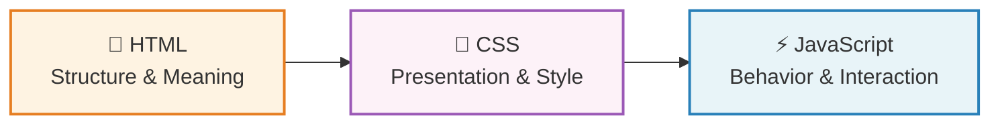
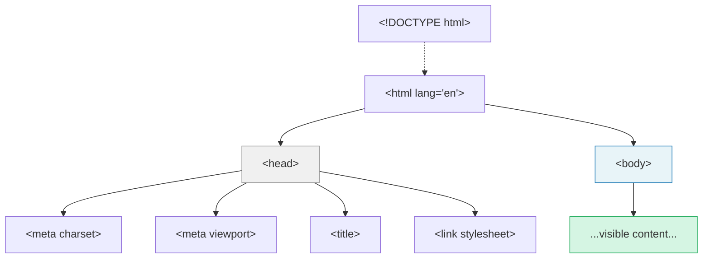
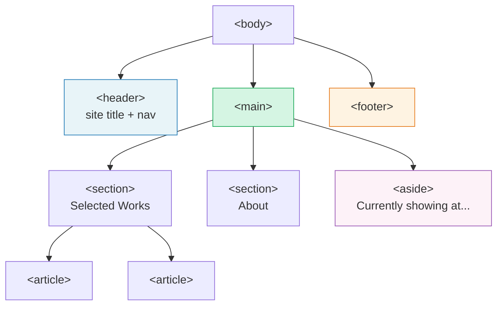
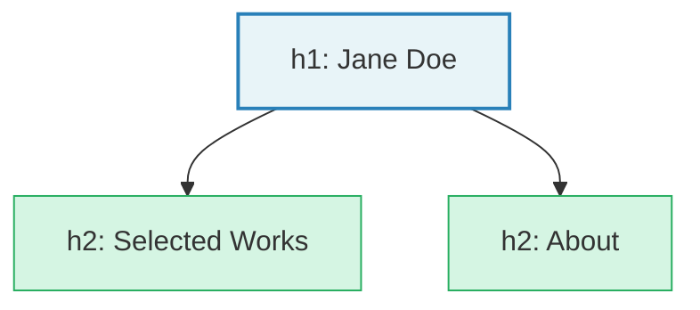

# Modern HTML for Artists

*This is Part 1 of a two-part guide. It covers HTML (Chapters 1-8). Part 2, Modern CSS for Artists, picks up where this leaves off and covers CSS (Chapters 9-20). They're designed to be read in order, but the HTML guide stands on its own if you're not ready for CSS yet.*

## Prelude: The Living Document

A painting or a print has a fixed form. Once it's finished, it stays finished. A website is different. It's a living document. Content gets added, removed, and rearranged. Pages grow. Features change. The work is never truly "done" in the way a finished piece of art is.

This means that as changes compound over time, structure and organisation matter more than they might in a static medium. But structure isn't just a practical concern. It's a craft in its own right. The way you organise your code has its own aesthetics: the rhythm of well-named elements, the satisfaction of a layout that accommodates change without breaking, the elegance of a system where every piece has a clear reason to exist. Learning to see and appreciate that structure is part of becoming good at this.

These guides focus heavily on that craft, because getting it right from the start is one of the most valuable things you can do.

## Chapter 1: What is HTML?

HTML (HyperText Markup Language) is the language that gives a web page its **structure and meaning**. It doesn't control how things look (that's CSS's job) and it doesn't control how things behave (that's JavaScript's job). HTML simply says: "this is a heading," "this is a paragraph," "this is an image of a painting."

Think of it as three layers, each with a distinct job:



HTML is the sketch, the wireframe, the composition before any rendering. CSS is the color, the type, the spacing, the visual treatment. JavaScript is the interaction, the dynamic response.

If you stripped away all the CSS from any website, you'd be left with a plain document of text, images, and links. That document should still make sense on its own. It should still have a clear hierarchy, a logical reading order, and meaningful structure. That is what good HTML gives you.

> **See it for yourself:** Want to know what "good structure without any styling" actually looks like? Here's the portfolio page from Chapter 8, rendered with [construct.css](https://t7.github.io/construct.css/), a tool that draws visible boxes around every semantic HTML element. Every `<header>`, `<main>`, `<section>`, `<article>`, and `<footer>` gets a labeled outline, making invisible structure visible. We'll come back to this at the end of the guide.
>
> [▶ View the portfolio structure demo](demos/html/ch1-construct-portfolio.html)

### Why "semantic" HTML matters

The word **semantic** means "relating to meaning." When we talk about semantic HTML, we mean choosing elements based on what the content *is*, not what we want it to *look like*.

For example, you might want some text to appear big and bold. You could wrap it in a generic element and style it with CSS. But if that text is actually a heading, you should use a heading element. Why?

- **Accessibility**: Screen readers and assistive technologies rely on HTML to understand the page. A heading element tells a screen reader "this is a heading." A styled `<div>` tells it nothing.
- **Search engines**: Search engines read the HTML structure to understand what a page is about.
- **Your future self**: Meaningful markup is easier to read, maintain, and style.

The good news is that choosing the right element is usually intuitive. You already know the difference between a heading and a paragraph, between a navigation menu and a footer. HTML just asks you to make that explicit.

## Chapter 2: Getting Set Up

Before you write any code, you need a few tools. The good news is that everything you need is free, and setup takes about five minutes.

### A text editor

You need a text editor designed for code, not a word processor like Google Docs or Microsoft Word. The most popular choice is **[Visual Studio Code](https://code.visualstudio.com/)** (usually called VS Code). It's free, runs on Mac, Windows, and Linux, and has excellent support for HTML and CSS out of the box.

When you first open VS Code, create a new folder for your project (File > Open Folder), then create a new file called `index.html`. Make sure the file is saved with **UTF-8 encoding** (VS Code does this by default; you can check in the bottom status bar). This matches the `<meta charset="UTF-8">` declaration in your HTML and ensures characters like accented letters, special symbols, and emoji display correctly.

You'll notice that VS Code gives you syntax highlighting (different parts of your code appear in different colors), auto-closing tags, and helpful suggestions as you type. These aren't cosmetic touches. They make it much easier to spot mistakes.

VS Code also includes a tool called Emmet that expands shorthand into HTML. Try typing `!` and pressing Tab in an empty `.html` file to generate a starter skeleton. You'll pick up more shortcuts naturally as you go.

Other good options include [Zed](https://zed.dev/), [Sublime Text](https://www.sublimetext.com/), and [Nova](https://nova.app/) (Mac only). Any of these will serve you well. Pick one and get comfortable with it.

### Previewing your work

Once you've saved an HTML file, you can open it directly in your browser. On most systems, double-clicking the `.html` file will do it. You'll see your page, and the address bar will show a `file:///` path.

This works for getting started, but you'll quickly want a **live preview** that refreshes automatically whenever you save a change. In VS Code, install the **Live Preview** extension (by Microsoft). It gives you a one-click preview that updates in real time. Right-click your HTML file and choose "Show Preview" to get started.

### Browser developer tools

This is the single most important tool you'll use after your text editor, and it's already built into your browser. Every modern browser (Chrome, Firefox, Safari, Edge) includes a set of developer tools that let you inspect, debug, and experiment with any web page, including your own.

To open them:

- **Chrome / Edge**: Right-click any element on the page and choose "Inspect," or press `F12` or `Ctrl+Shift+I` (Windows/Linux) or `Cmd+Option+I` (Mac).
- **Firefox**: Same shortcuts, or right-click and choose "Inspect."
- **Safari**: First enable them in Safari > Settings > Advanced > "Show features for web developers." Then right-click and choose "Inspect Element."

The two panels you'll use most:

**The Elements panel** (called "Inspector" in Firefox) shows the HTML structure of the page as a live, interactive tree. You can click on any element to see its CSS on the right side. You can also edit the HTML and CSS directly in the panel to experiment. None of your changes are permanent; refreshing the page resets everything. This makes it a perfect sandbox for trying things out.

**The box model diagram** appears when you select an element in the Elements panel. It shows the content, padding, border, and margin as a visual, layered rectangle. When we cover the box model in the CSS guide, this diagram will make the concept click immediately.

Get in the habit of opening the developer tools whenever something looks wrong (or right) on your page. Inspecting how other people's websites are built is one of the best ways to learn.

## Chapter 3: Your First HTML Page

Every HTML page shares the same basic skeleton. Here's the minimum you need:

```html
<!DOCTYPE html>
<html lang="en">
  <head>
    <meta charset="UTF-8">
    <meta name="viewport" content="width=device-width, initial-scale=1.0">
    <title>My Portfolio</title>
    <link rel="stylesheet" href="style.css">
  </head>
  <body>
    <!-- Your visible content goes here -->
  </body>
</html>
```

This is the first time you're seeing elements nested inside other elements, so it helps to see the structure as a tree. Each element "contains" the elements indented below it:



The `<head>` is invisible to visitors. Everything the user actually sees lives inside `<body>`. Let's walk through each piece.

### The doctype

```html
<!DOCTYPE html>
```

This line tells the browser: "This is a modern HTML document." It must be the very first thing in the file. You write it once and never think about it again.

### Attributes

In the skeleton above, you'll have noticed extra information inside several opening tags: `lang="en"`, `charset="UTF-8"`, `href="style.css"`. These are **attributes**. They follow the pattern `name="value"` and provide additional details about the element: where a link goes, what language the page is in, what file to load.

We'll use attributes constantly throughout this guide. Most are self-explanatory in context (`src` is a source, `href` is a hyperlink reference), and I'll explain each one as it comes up. Chapter 8 covers the most important attributes in one place for reference.

### The `<html>` element

```html
<html lang="en">
```

Everything else goes inside the `<html>` element. It's the root of your document.

The `lang` attribute declares the language of the page. This helps screen readers pronounce text correctly and helps search engines serve your page to the right audience. Use `"en"` for English, `"fr"` for French, `"ja"` for Japanese, and so on. For regional variants, add a subtag: `"pt-BR"` for Brazilian Portuguese is distinct from `"pt"` for European Portuguese, and `"en-GB"` is distinct from `"en-US"`. Getting this right matters for screen readers, spell-checkers, and hyphenation. See the [MDN `lang` attribute reference](https://developer.mozilla.org/en-US/docs/Web/HTML/Reference/Global_attributes/lang) for the full list of valid values.

### The `<head>` element

The `<head>` contains information *about* the page that doesn't appear on the page itself. Think of it as the metadata: the behind-the-scenes setup.

```html
<head>
  <meta charset="UTF-8">
  <meta name="viewport" content="width=device-width, initial-scale=1.0">
  <title>My Portfolio</title>
  <link rel="stylesheet" href="style.css">
</head>
```

- `<meta charset="UTF-8">` ensures the browser can display a wide range of characters, from accented letters to emoji.
- `<meta name="viewport" ...>` tells mobile browsers to match the screen's actual width. (The **viewport** is the visible area of the browser window, the rectangle you're looking at right now.) **Without this line, your fluid responsive design will not work on phones.** It's one line of code, but it's critical.
- `<title>` sets the text that appears in the browser tab and in search results.
- `<link rel="stylesheet" href="style.css">` connects your CSS file. The `href` points to the file location, and `rel="stylesheet"` tells the browser what that file is for. The CSS file won't exist yet, and that's fine. We'll create it in the CSS guide.

### The `<body>` element

Everything the visitor actually sees goes inside `<body>`. Text, images, links, navigation: all of it.

```html
<body>
  <h1>Welcome to my portfolio</h1>
  <p>I'm an artist working with oil and digital media.</p>
</body>
```

### A note on nesting and indentation

HTML elements can contain other elements. When they do, we indent the inner elements to show the relationship visually:

```html
<body>
  <header>
    <h1>Site Title</h1>
    <nav>
      <a href="/">Home</a>
      <a href="/work">Work</a>
    </nav>
  </header>
</body>
```

This indentation is purely for readability. The browser doesn't care about it. But you will, two weeks from now when you're trying to figure out where something went wrong.

> **A note on link paths:** You'll see paths like `/work` and `/about` throughout this guide. These are *site-relative paths* that point to other pages on a website. They only work when your site is served by a web server (including the Live Preview extension from Chapter 2). If you're opening your HTML file directly in a browser (with a `file:///` address), these links won't work. That's okay. For now, you can use paths like `work.html` or `about.html` if you want to link to other files in the same folder, or just treat these examples as illustrations of how a finished site would be structured.

## Chapter 4: Text and Content Elements

These are the elements you'll use to mark up the actual content of your page.

### Headings: `<h1>` through `<h6>`

Headings create a hierarchy, like a table of contents. `<h1>` is the most important, `<h6>` the least.

```html
<h1>Jane Doe</h1>
<h2>Selected Works</h2>
<h3>Oil Paintings</h3>
<h3>Digital Works</h3>
<h2>About</h2>
<h2>Contact</h2>
```

> **Live demo:** See all six heading levels rendered with default browser styling. Try editing the text to see how the visual hierarchy works even without CSS.
>
> [▶ Headings hierarchy demo](demos/html/ch4-headings.html)

A few important rules:

- **Don't skip levels.** Go from `<h2>` to `<h3>`, not from `<h2>` to `<h4>`.
- **Use only one `<h1>` per page.** It represents the page's primary topic.
- **Choose heading level based on hierarchy, not size.** If you want a heading to look smaller, that's CSS's job. The heading level should reflect its place in the document's outline.

A good test: if you pulled out just the headings, would they read like a sensible table of contents? If so, your hierarchy is solid.

### Paragraphs: `<p>`

The workhorse of text content.

```html
<p>This series explores the tension between natural forms and digital artifacts.</p>
<p>Each piece began as a plein air sketch before being reinterpreted in Procreate.</p>
```

Each `<p>` creates a distinct block of text. Don't use `<br>` (line break) to create spacing between paragraphs. If it's a new thought, it's a new `<p>`.

### Inline text elements

Some elements are meant to be used *inside* other elements, to mark up specific words or phrases.

**`<strong>`: Strong importance**

```html
<p>The exhibition opens <strong>March 15th</strong> and runs through April.</p>
```

This tells the browser (and screen readers) that "March 15th" has strong importance. It happens to be bold by default, but the meaning is what matters.

**`<em>`: Emphasis**

```html
<p>The work is not <em>about</em> the medium, but about the process.</p>
```

Emphasis changes the meaning of a sentence, similar to how stressing a word when speaking changes its meaning. It happens to be italic by default.

**`<b>` and `<i>`: Visual without semantic weight**

HTML also has `<b>` (bold) and `<i>` (italic). These look the same as `<strong>` and `<em>` by default, but they carry different meaning. `<strong>` means "this is important." `<b>` means "draw attention to this text" without implying importance. `<em>` means "this word is stressed." `<i>` means "this text is set apart" from the surrounding prose, like a technical term, a phrase in another language, or a ship name:

```html
<p>The French call it <i lang="fr">plein air</i> painting.</p>
<p>The <i>HMS Endeavour</i> departed in 1768.</p>
<p>Key materials: <b>linseed oil</b>, <b>turpentine</b>, <b>damar varnish</b>.</p>
```

The distinction matters for semantics. Screen readers don't typically change their intonation for any of these elements by default, but `<em>` and `<strong>` carry semantic weight that assistive technologies *can* expose (some screen readers have optional settings to announce emphasis). More importantly, the semantic distinction helps your future self and other developers understand the *intent* of the markup. Choose based on meaning, not appearance.

**`<del>`: Deleted text**

`<del>` marks text that has been removed or is no longer accurate. Browsers render it with a strikethrough by default:

```html
<p>Price: <del>€500</del> €400</p>
```

Some screen readers (like NVDA) can be configured to announce deleted text, though support is inconsistent across assistive technologies. Still, using `<del>` is more accessible than styling a strikethrough with CSS alone, because it provides semantic information that assistive technologies *can* convey.

**`<s>`: No longer accurate**

`<s>` is similar to `<del>`, but with a different meaning. While `<del>` indicates text that has been removed from the document, `<s>` marks text that is no longer accurate or relevant but hasn't been "deleted" as such:

```html
<p><s>Available for commission work</s> Currently booked through September.</p>
```

Both render as a strikethrough by default. The distinction is semantic: `<del>` is for edits to a document, `<s>` is for content that's been superseded.

**`<u>`: Unarticulated annotation**

`<u>` renders as an underline by default. It's used for text that needs non-textual annotation, like marking proper nouns in Chinese, or flagging a misspelling:

```html
<p>The text contains a <u class="spelling-error">mispeling</u> that was flagged during review.</p>
```

Be careful with `<u>` on the web. Underlined text looks like a link, which can confuse users. If you're reaching for `<u>` purely to underline something visually, use CSS instead.

> **Live demo:** See all the inline text elements rendered side by side, so you can compare how `<strong>`, `<em>`, `<b>`, `<i>`, `<del>`, `<s>`, and `<u>` look with default browser styling.
>
> [▶ Inline text elements comparison](demos/html/ch4-inline-text.html)

**`<time>`: Dates and times**

```html
<p>The exhibition opens <time datetime="2025-03-15">March 15, 2025</time> and runs through <time datetime="2025-04-30">April 30th</time>.</p>
```

The `<time>` element marks up a date or time. The `datetime` attribute provides a machine-readable version, while the text inside is whatever human-friendly phrasing you prefer. The most common format is `YYYY-MM-DD`, but `datetime` also accepts year only (`2025`), year-month (`2025-03`), date with time (`2025-03-15T10:00`), time only (`10:00`), and durations (`PT2H30M`). This helps search engines, screen readers, and browser tools understand that "March 15, 2025" is an actual date, not just three words. You'll find it especially useful for exhibition dates, artwork years, and event listings. You can combine `<time>` with other inline elements: `<strong><time datetime="2025-03-15">March 15</time></strong>` if a date is both important and needs to be machine-readable.

### Lists

**Unordered list (`<ul>`):** for items where the order doesn't matter.

```html
<ul>
  <li>Oil on canvas</li>
  <li>Charcoal on paper</li>
  <li>Digital (Procreate)</li>
</ul>
```

**Ordered list (`<ol>`):** for items where the order matters.

```html
<ol>
  <li>Apply the base wash</li>
  <li>Block in the major shapes</li>
  <li>Refine edges and details</li>
  <li>Final glaze</li>
</ol>
```

Every item inside a list must be an `<li>` (list item). You can also nest lists inside `<li>` elements for sub-levels.

### Description lists

Description lists are used for key-value pairs or term-definition relationships. They're perfect for artwork metadata:

```html
<dl>
  <dt>Medium</dt>
  <dd>Oil on canvas</dd>

  <dt>Dimensions</dt>
  <dd>120 × 80 cm</dd>

  <dt>Year</dt>
  <dd>2025</dd>
</dl>
```

- `<dl>` wraps the whole list.
- `<dt>` is the term (or key).
- `<dd>` is the description (or value).

> **Live demo:** All three list types rendered side by side with default browser styling. Description lists in particular are unfamiliar to most beginners, so seeing them next to the familiar `<ul>` and `<ol>` makes the differences clear.
>
> [▶ Lists comparison demo](demos/html/ch4-lists.html)

### Blockquotes and citations

For quoting text from another source:

```html
<blockquote cite="https://en.wikiquote.org/wiki/Claude_Monet">
  <p>Color is my day-long obsession, joy and torment.</p>
  <footer>—Claude Monet</footer>
</blockquote>
```

`<blockquote>` indicates an extended quotation. The `cite` attribute can provide a URL for the source. The `<footer>` inside the blockquote holds the attribution. (Note: the WHATWG spec technically says content inside a `<blockquote>` should only be quoted content. An alternative approach is to wrap the whole thing in a `<figure>` and use `<figcaption>` for attribution. The `<footer>` inside `<blockquote>` pattern is a widespread convention, and you'll see it used often.)

> **Live demo:** See blockquotes rendered with default browser indentation and styling.
>
> [▶ Blockquote demo](demos/html/ch4-blockquote.html)

If you're attributing a quote to a specific work, use the `<cite>` element for the work's title:

```html
<blockquote cite="https://en.wikiquote.org/wiki/Salvador_Dalí">
  <p>Don't be afraid of perfection. You will never attain it!</p>
  <footer>—Salvador Dalí, <cite>Diary of a Genius</cite></footer>
</blockquote>
```

### Character references

Some symbols can't be typed directly or have special meaning in HTML. For these, you can use **character references** like `&copy;` (&copy;), `&reg;` (&reg;), and `&trade;` (&trade;). You'll see `&copy;` used in footer copyright notices throughout this guide. For a full list, see the [MDN glossary entry on character references](https://developer.mozilla.org/en-US/docs/Glossary/Character_reference).

## Chapter 5: Structural Elements

Structural elements give your page its overall shape. They define the large sections that organize your content. If text elements are the individual brush strokes, structural elements are the composition.

### The landmarks

These are the elements that define the major regions of a page. Screen readers and other tools recognize these as landmarks, allowing users to jump directly to them. Here's how a typical artist portfolio page breaks down into landmarks:



And here's what the code looks like:

```html
<body>
  <header>
    <h1><a href="/">Jane Doe</a></h1>
    <nav aria-label="Primary">
      <a href="/work">Work</a>
      <a href="/about">About</a>
      <a href="/contact">Contact</a>
    </nav>
  </header>

  <main>
    <!-- The main content of the page -->
  </main>

  <footer>
    <p>&copy; 2025 Jane Doe. All rights reserved.</p>
  </footer>
</body>
```

**`<header>`** typically contains the site title/logo and primary navigation. Wrapping the site name in `<h1>` gives it the correct heading level. You can also use `<header>` inside an `<article>` or `<section>` to mark the heading area of that particular block of content.

**`<main>`** wraps the primary content of the page. There should only be one `<main>` per page. It excludes things like the site header, footer, and sidebar navigation that repeat across every page.

**`<footer>`** contains information like copyright notices, secondary links, or contact details. Like `<header>`, it can also be used inside other elements.

> **See the structure:** Here's the landmark code above rendered with construct.css. Every semantic element gets a visible, labeled outline, so you can see exactly where `<header>`, `<main>`, `<section>`, `<article>`, `<aside>`, and `<footer>` live in the page:
>
> [▶ Landmark structure with construct.css](demos/html/ch5-landmarks-construct.html)

**`<nav>`** is for major navigation blocks. Not every group of links needs a `<nav>`, just the primary navigation areas. If you have more than one `<nav>` on a page, give each one an `aria-label` so screen readers can tell them apart (we'll cover `aria-label` properly in the attributes chapter):

```html
<nav aria-label="Primary">...</nav>
<nav aria-label="Social media links">...</nav>
```

### Organizing your content

Inside `<main>`, you'll use these elements to group related content:

**`<section>`:** A thematic grouping of content, usually with its own heading. Note that a `<section>` is only exposed as a navigable landmark to screen readers when it has an accessible name (via `aria-label` or `aria-labelledby`). Without one, assistive technology treats it similarly to a `<div>`:

```html
<section aria-label="Selected Works">
  <h2>Selected Works</h2>
  <!-- artwork grid goes here -->
</section>

<section aria-label="Exhibitions">
  <h2>Exhibitions</h2>
  <!-- exhibition list goes here -->
</section>
```

**`<article>`:** A self-contained piece of content that could stand on its own. If you could syndicate it (share it, repost it, display it in a feed), it's probably an `<article>`.

```html
<article>
  <h2>Notes on Process: The Harbor Series</h2>
  <p>This series began during a residency in Marseille...</p>
</article>
```

A page can contain multiple articles (like a blog listing), and articles can contain sections. Don't overthink the distinction. If in doubt, ask: "Does this content make sense on its own, outside of this page?" If yes, it's an article. If it's a thematic chunk within a larger page, it's a section.

**`<aside>`:** Content that's related to the main content but could be considered separate. Sidebars, pull quotes, related links, or supplementary information.

```html
<aside>
  <h2>Currently showing at</h2>
  <p>Galleri Nord, Stockholm - through April 2025</p>
</aside>
```

### Generic containers: `<div>` and `<span>`

Every element we've covered so far carries meaning. `<div>` and `<span>` are the two exceptions: they are purely structural hooks with **no semantic meaning** at all. You use them when you need a container for styling purposes and no semantic element is appropriate.

**`<div>`** is a block-level container. Meaning it takes up the full width available and starts on a new line, like a paragraph. It's the one you'll reach for when you need a wrapper around a group of elements:

```html
<div class="wrapper">
  <!-- content that needs a max-width constraint -->
</div>
```

**`<span>`** is its inline counterpart. It sits within a line of text without breaking it, like a highlighted word. Use it when you need a styling hook around a word or phrase but no semantic inline element (`<strong>`, `<em>`, etc.) fits:

```html
<p>Available in <span class="color-swatch" style="--swatch: #120A8F">ultramarine</span> and <span class="color-swatch" style="--swatch: #E97451">burnt sienna</span>.</p>
```

The rule of thumb for both: if a more specific element fits, use that instead. Reach for `<div>` and `<span>` last.

> **Why semantics? A visual comparison.** This demo shows the same content twice: once built entirely with `<div>` elements, and once with proper semantic HTML. With construct.css rendering both, the semantic version has labeled outlines (`header`, `nav`, `main`, `footer`) while the `<div>` version shows only anonymous boxes. The argument for semantic HTML stops being theoretical when you can see it:
>
> [▶ div vs. semantic elements side by side](demos/html/ch5-div-vs-semantic.html)

## Chapter 6: Images, Figures, and Media

As an artist, this chapter is arguably the most relevant to you. How you present your visual work matters.

### Basic images

```html

```

A few things to note:

- **`src`** points to the image file.
- **`alt`** describes the image for people who can't see it (screen reader users, or when the image fails to load). For artwork, describe what the piece depicts, not just its title. **The `alt` attribute is mandatory.** Every `` must have one. For decorative images, use an empty value (`alt=""`), but never omit the attribute entirely.
- **`width` and `height`** tell the browser the image's dimensions. This allows the browser to reserve the right amount of space before the image loads, preventing layout shifts. These values represent the image's intrinsic size in pixels.
- **`loading="lazy"`** tells the browser to defer loading the image until the user scrolls near it. On a portfolio page with dozens of high-resolution artworks, this makes a significant difference: the browser loads only the images that are actually visible, rather than downloading everything at once. Add it to any image that isn't visible in the initial viewport.
- **`decoding="async"`** tells the browser it can decode the image in the background without blocking the rest of the page from rendering. On image-heavy portfolio pages, this keeps the page feeling responsive while large artworks load.

#### Writing good alt text for artwork

This deserves special attention. The alt text should help someone who can't see the image understand what they're missing.

```html
<!-- Too vague -->


<!-- Just a title, not descriptive -->


<!-- Descriptive -->

```

If the image is purely decorative (a background pattern, a visual divider), use an empty alt: `alt=""`. This tells screen readers to skip it entirely.

### Figures and captions

When an image (or any content) is referenced from the main text and needs a caption, wrap it in a `<figure>`:

```html
<figure>
  
  <figcaption>
    Harbor Study No. 3 - Oil on panel, 30 × 40 cm, 2025
  </figcaption>
</figure>
```

> **Live demo:** See a `<figure>` with `<figcaption>` rendered with default browser styling. For an art audience, seeing how the browser groups your work with its caption matters.
>
> [▶ Figure and figcaption demo](demos/html/ch6-figure.html)

`<figure>` isn't only for images. It's for any self-contained content that's referenced from the main flow: diagrams, code snippets, charts, or even embedded videos.

```html
<figure>
  <video src="process-timelapse.mp4" controls width="1200" height="800">
    Your browser does not support the video element.
  </video>
  <figcaption>Timelapse of the painting process (3 min)</figcaption>
</figure>
```

### Video and audio

If you work with video or sound, HTML has native elements for both:

```html
<video src="process-timelapse.mp4" controls width="1200" height="800">
  Your browser does not support the video element.
</video>

<audio src="studio-ambience.mp3" controls>
  Your browser does not support the audio element.
</audio>
```

The `controls` attribute gives the user play/pause, volume, and a progress bar. The text inside the element is fallback content for browsers that don't support the element (rare today, but good practice). Both `<video>` and `<audio>` support multiple `<source>` elements for format fallbacks, just like `<picture>` does for images.

For longer or higher-quality video, you'll likely want to host on a service like Vimeo or YouTube and embed with an `<iframe>` rather than serving files directly. But for short process clips, timelapses, or audio sketches, native elements work well and keep everything on your own site.

### Responsive images with `<picture>`

Sometimes you want to serve different image files depending on the context. Perhaps a tightly cropped version for small screens, or a WebP version for browsers that support it.

```html
<picture>
  <source srcset="harbor-study.avif" type="image/avif">
  <source srcset="harbor-study.webp" type="image/webp">
  
</picture>
```

The browser picks the first `<source>` it supports and falls back to the ``. This lets you serve modern, smaller formats (AVIF, WebP) while keeping a JPEG as a safe fallback.

You can also combine `<source>` with media conditions for **art direction**: showing different image crops at different screen sizes. We'll cover media conditions properly in the CSS guide, but here's what the markup looks like:

```html
<picture>
  <source media="(min-width: 800px)" srcset="harbor-wide.jpg">
  <source media="(min-width: 400px)" srcset="harbor-medium.jpg">
  
</picture>
```

The browser checks each `<source>` in order and picks the first one whose media condition matches. The `` at the end serves as the fallback.

## Chapter 7: Links, Buttons, and Interactive Elements

### Links: `<a>`

Links take you somewhere. They're the connections between pages.

```html
<a href="/work">View my work</a>
<a href="https://instagram.com/janedoe">Follow on Instagram</a>
<a href="mailto:hello@janedoe.com">Get in touch</a>
```

- `href` specifies the destination: a page on your site, an external URL, or a `mailto:` link for email.

Write link text that makes sense on its own. Screen readers often present links as a list, stripped from their surrounding text.

```html
<!-- Unhelpful -->
<p>To see my work, <a href="/work">click here</a>.</p>

<!-- Clear and self-descriptive -->
<p><a href="/work">View my selected works</a></p>
```

### Buttons: `<button>`

Buttons perform actions. They don't navigate anywhere.

```html
<button>Open gallery</button>
<button>Toggle dark mode</button>
```

> **Live demo:** See a link and a button rendered side by side with no custom CSS, so you can see how the browser treats them differently by default.
>
> [▶ Link vs. button demo](demos/html/ch7-link-vs-button.html)

The distinction matters:

- **Link**: "Take me somewhere" (navigates to a URL).
- **Button**: "Do something" (triggers an action on the current page).

If you're ever tempted to style a link to look like a button or use a `<div>` with a click handler, step back and ask: does this navigate or act? Then use the right element. Use CSS classes to make a link *look* like a button if needed (we'll cover this in the CSS guide), but keep the underlying HTML honest.

**Never nest links inside buttons or buttons inside links.** This is a common mistake, and it creates confusing, broken behavior for both browsers and screen readers:

```html
<!-- Don't do this -->
<button>
  <a href="/work">View more</a>
</button>
```

If something navigates, it's a link. If it triggers an action, it's a button. It can't be both.

One thing that *is* allowed in modern HTML: links can wrap around block-level content like headings, paragraphs, and images. This is useful for making entire card-like regions clickable:

```html
<a href="/work/harbor-study">
  <figure>
    
    <figcaption>Harbor Study No. 3</figcaption>
  </figure>
</a>
```

### Details and summary

This pair gives you an expandable/collapsible section with no JavaScript required:

```html
<details>
  <summary>Exhibition history</summary>
  <ul>
    <li>2025 - Galleri Nord, Stockholm</li>
    <li>2024 - Open Studio, Malmö</li>
    <li>2023 - Group show, Konstakademien</li>
  </ul>
</details>
```

> **Live demo:** Click to expand and collapse sections, all built with pure HTML. This is one of the few interactive elements that needs zero JavaScript.
>
> [▶ Details and summary interactive demo](demos/html/ch7-details-summary.html)

The `<summary>` is the always-visible label. Everything else inside `<details>` is hidden until the user clicks to expand it. This is great for:

- Artist CVs and exhibition histories
- FAQ sections
- Technical details about a piece (materials, process)
- Anything where you want to keep the page clean but offer depth on demand

## Chapter 8: Attributes and the Bigger Picture

I introduced attributes briefly in Chapter 3: extra information inside an element's opening tag, following the pattern `name="value"`. You've been using them throughout this guide. Now let's look at the specific attributes you'll reach for most often.

**`class`** is your primary hook for CSS styling. An element can have multiple classes, separated by spaces:

```html
<div class="wrapper flow">
  <h2 class="section-title">Selected Works</h2>
</div>
```

**`id`** is a unique identifier. No two elements on the same page should share an `id`. It's useful for in-page navigation:

```html
<section id="work">
  <h2>Selected Works</h2>
</section>

<!-- Somewhere else on the page -->
<a href="#work">Jump to my work</a>
```

**`data-*` attributes** let you attach custom information to elements. We'll see these used heavily in the CSS guide for handling exceptions in the CUBE CSS methodology, but for now, here's what they look like in the markup:

```html
<section data-theme="dark">
  <h2>Night Series</h2>
</section>

<section data-theme="light">
  <h2>Watercolors</h2>
</section>
```

**`aria-label`** provides an accessible name when the visual context alone isn't enough. This is the attribute we used earlier to distinguish multiple `<nav>` elements, but it's useful anywhere the visible text doesn't fully describe the element's purpose:

```html
<button aria-label="Close gallery overlay">×</button>
<a href="/work/harbor-study" aria-label="View Harbor Study No. 3">
  
</a>
```

Note that `aria-label` on a link *overrides* the accessible name that would otherwise come from its contents (including any image `alt` text). When using `aria-label` on a link, set the image's `alt` to empty (`alt=""`) to avoid redundancy. If the image's `alt` text is already sufficient as a link description, you can omit the `aria-label` entirely.

### The document as a whole

Before we move on to CSS, take a step back and look at a small but complete page. Every element chosen for its meaning, every attribute adding necessary information:

```html
<!DOCTYPE html>
<html lang="en">
  <head>
    <meta charset="UTF-8">
    <meta name="viewport" content="width=device-width, initial-scale=1.0">
    <title>Jane Doe - Artist</title>
    <link rel="stylesheet" href="style.css">
  </head>
  <body>
    <header>
      <h1><a href="/">Jane Doe</a></h1>
      <nav aria-label="Primary">
        <a href="/work">Work</a>
        <a href="/about">About</a>
        <a href="/contact">Contact</a>
      </nav>
    </header>

    <main>
      <section id="selected-works" aria-label="Selected Works">
        <h2>Selected Works</h2>

        <article>
          <figure>
            
            <figcaption>Harbor Study No. 3 - Oil on panel, 30 × 40 cm, <time datetime="2025">2025</time></figcaption>
          </figure>
        </article>

        <article>
          <figure>
            
            <figcaption>Night Garden - Acrylic on canvas, 100 × 75 cm, <time datetime="2024">2024</time></figcaption>
          </figure>
        </article>
      </section>

      <section id="about" aria-label="About">
        <h2>About</h2>
        <p>I'm a painter based in Stockholm, working primarily in oil and acrylic. My work explores the boundary between observation and memory.</p>

        <details>
          <summary>Exhibition history</summary>
          <dl>
            <dt><time datetime="2025">2025</time></dt>
            <dd>Galleri Nord, Stockholm - Solo show</dd>

            <dt><time datetime="2024">2024</time></dt>
            <dd>Open Studio, Malmö - Group exhibition</dd>
          </dl>
        </details>
      </section>
    </main>

    <footer>
      <p>&copy; 2025 Jane Doe</p>
      <nav aria-label="Social media links">
        <a href="https://instagram.com/janedoe">Instagram</a>
      </nav>
    </footer>
  </body>
</html>
```

Without a single line of CSS, this document communicates its structure clearly. A screen reader can navigate it. A search engine can index it. And when we add CSS, we have clean, meaningful markup to build on.

> **The capstone visual:** Here's this complete portfolio page rendered with construct.css. Every semantic element is labeled and visible. This is the structure you've been building toward across all eight chapters:
>
> [▶ View the complete portfolio structure](demos/html/ch1-construct-portfolio.html)

Remember the "table of contents test" from Chapter 4? Pull out just the headings from this page and they form a clear outline:



A sensible, two-level outline. No skipped levels, one clear `<h1>`, logical groupings. If your headings pass this test, your document structure is solid.

That's the goal of good HTML: a solid, honest foundation for everything that follows.

### What I didn't cover: forms

You may have noticed that this guide doesn't cover HTML forms (contact forms, email sign-ups, and the like). Forms involve a substantial set of elements (`<form>`, `<label>`, `<input>`, `<textarea>`, `<select>`) and their own accessibility considerations. More importantly, a form doesn't actually *do* anything without a server or a third-party service to receive the submission, which is outside the scope of an HTML and CSS guide.

For a portfolio site, a `mailto:` link or a link to your social profiles will serve you well to start. If you use a `mailto:` link, make the link text descriptive (like "Get in touch" or "Email me") rather than displaying a raw email address, which is harder for screen readers to parse and easier for spam scrapers to harvest. When you're ready to add a contact form, the [MDN Web Forms Guide](https://developer.mozilla.org/en-US/docs/Learn/Forms) is thorough and well-structured, and services like [Formspree](https://formspree.io/) or [Netlify Forms](https://docs.netlify.com/forms/setup/) handle the server side for you.

### Accessibility checklist

Before you move on to CSS, run through this quick check. Everything here is a practical application of what you've already learned in this guide.

- Does every content image have descriptive `alt` text? (Decorative images should have `alt=""`.)
- Do your headings follow a logical hierarchy (`h1` then `h2` then `h3`, no skipped levels)?
- Is there only one `<h1>` per page?
- Does the page use landmark elements (`<header>`, `<main>`, `<nav>`, `<footer>`) rather than generic `<div>`s for major sections?
- If there's more than one `<nav>`, does each have a distinct `aria-label`?
- Does every `` have `width` and `height` attributes to prevent layout shifts?
- Does the `<html>` element have a `lang` attribute?
- Does link text make sense on its own, without the surrounding sentence?

None of these require testing tools. Just read through your HTML and check. We'll later cover how to verify color contrast and test with screen readers, but this list will catch the most common structural issues before you get there.

### You now have a complete foundation

With what you've learned in these eight chapters, you can build a well-structured, accessible, meaningful web page from scratch. Not a page that *looks* finished (that's CSS's job), but one that *works*: a page a screen reader can navigate, a search engine can understand, and your future self can maintain. That's not a small thing. Most of the web is built on shaky HTML. Yours won't be.

**Next up:** CSS, where we bring this structure to life.
